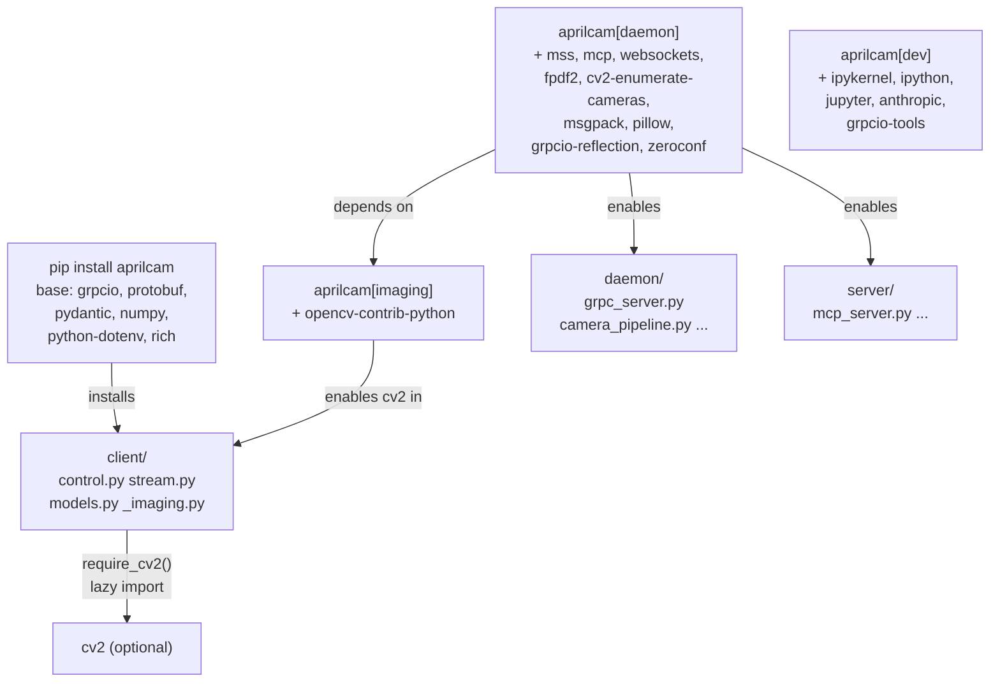

<!-- CLASI: Before changing code or making plans, review the SE process in CLAUDE.md -->

# Architecture Update — Sprint 010: Split Client vs. Daemon Dependencies

## What Changed

### 1. `pyproject.toml` — Dependency Partition

The monolithic `[project] dependencies` list is replaced with a narrow base and
four optional extras.

**Base `dependencies` (client only):**
`grpcio>=1.60`, `protobuf>=4.25`, `pydantic>=2.0`, `numpy>=1.23`,
`python-dotenv>=1.0`, `rich>=13.0`

**`[project.optional-dependencies]`:**

| Extra | Contents |
|-------|----------|
| `imaging` | `opencv-contrib-python>=4.8` |
| `daemon` | `aprilcam[imaging]`, `mss>=9.0`, `mcp>=1.0`, `websockets>=12.0`, `fpdf2>=2.7`, `cv2-enumerate-cameras>=1.3`, `msgpack>=1.0`, `pillow>=10.0`, `grpcio-reflection>=1.60`, `zeroconf>=0.131` |
| `dev` | `ipykernel>=7.2.0`, `ipython>=8.39.0`, `jupyter>=1.1.1`, `anthropic>=0.104.0`, `grpcio-tools>=1.60` |
| `playfield` | `pygame>=2.5` (unchanged) |

The self-referential `aprilcam[imaging]` in `daemon` ensures OpenCV is not
duplicated across extras. `python-dotenv` and `rich` stay in base because the
`aprilcam` console entry point (light subcommands `init`, `tool`, `--version`)
must function with a client-only install.

The `[dependency-groups] dev` section in `pyproject.toml` is retained for
`uv`-based local development but is not the install path for production.

### 2. `src/aprilcam/client/_imaging.py` — New Lazy-Import Helper

A new module provides a single function:

```python
def require_cv2():
    try:
        import cv2
    except ModuleNotFoundError as e:
        raise RuntimeError(
            "Decoding camera frames requires OpenCV. "
            "Install it with `pip install 'aprilcam[imaging]'` "
            "(or `aprilcam[daemon]`)."
        ) from e
    return cv2
```

This module has no imports beyond the stdlib. It is the only location in the
`client` package that touches OpenCV.

### 3. `src/aprilcam/client/control.py` — Remove Top-Level `import cv2`

The top-level `import cv2` (line 18) is removed. `import numpy as np` is
retained (numpy is in base). At the `cv2.imdecode` call site in
`capture_frame` (approximately line 240), OpenCV is obtained lazily:

```python
cv2 = require_cv2()
frame = cv2.imdecode(buf, cv2.IMREAD_COLOR)
```

No other changes to `control.py`.

### 4. `src/aprilcam/client/stream.py` — Remove Top-Level `import cv2`

The top-level `import cv2` (line 15) is removed. `import numpy as np` is
retained. At the `cv2.imdecode` call site in `ImageStreamConsumer.read`
(approximately line 117):

```python
cv2 = require_cv2()
frame = cv2.imdecode(buf, cv2.IMREAD_COLOR)
```

No other changes to `stream.py`.

### 5. Test Suite — Pytest Markers for Optional Dependencies

Tests that require OpenCV or daemon modules are marked with a custom marker
so they skip automatically when the dependency is absent:

- `@pytest.mark.needs_cv2` — tests that call `cv2.imdecode` or otherwise
  require OpenCV directly.
- `@pytest.mark.needs_daemon` — tests that import from `aprilcam.daemon` or
  start real gRPC servers (already implicitly OpenCV-dependent).

A `conftest.py` fixture checks for each optional import at collection time and
calls `pytest.skip` if the package is absent. This ensures `pytest` exits 0
on a base install.

### 6. `README.md` / Install Docs — Updated Install Instructions

The README installation section is updated to document three install tiers:

- `pip install aprilcam` — lightweight client (gRPC stub only).
- `pip install 'aprilcam[imaging]'` — client with frame decoding.
- `pip install 'aprilcam[daemon]'` — full server stack.
- `pip install 'aprilcam[dev]'` — development tools.

---

## Why

| Change | Reason |
|--------|--------|
| Base deps narrowed to gRPC+pydantic+numpy | `pip install aprilcam` must complete quickly with no native-lib builds on machines without camera hardware |
| `imaging` extra | Separates frame-decode capability from the full daemon; lets a thin client optionally decode frames without pulling all server-side deps |
| `daemon` self-references `aprilcam[imaging]` | Avoids duplicating the opencv pin; installs imaging tier automatically when the daemon tier is requested |
| `dev` extra | Removes jupyter/ipython/anthropic/grpcio-tools from the production install path where they were only used for development notebooks |
| Lazy `require_cv2()` helper | Converts a module-level `ImportError` (which fires on `import control`) into a call-site `RuntimeError` with an actionable message — client can be imported without OpenCV present |
| Test markers | Ensures `pytest` is green in both configurations without skipping too broadly |

---

## Impact on Existing Components

| Component | Impact |
|-----------|--------|
| `pyproject.toml` | Rewritten dependency section. Entry point and build config unchanged. |
| `client/control.py` | Remove one `import` line; add `require_cv2()` call at one site. No API change. |
| `client/stream.py` | Remove one `import` line; add `require_cv2()` call at one site. No API change. |
| `client/_imaging.py` | New file. No other module imports it except `control.py` and `stream.py`. |
| `client/models.py` | No change — already pure pydantic, no cv2. |
| `client/__init__.py` | No change. |
| `daemon/` | No change to daemon source. The daemon's heavy deps are now gated by `[daemon]` extra, but the `.py` files still ship. |
| `server/` | No change to server source. |
| `tests/` | Add skip markers to tests that need cv2 or daemon. `conftest.py` updated. |
| `README.md` | Install section updated. No other docs change. |

---

## Migration Concerns

Existing developers who installed via `pip install -e .` (editable) will need
to run `pip install -e '.[daemon]'` to restore the full environment. This is a
one-time change to local development setup.

CI/CD pipelines that use `pip install aprilcam` will silently stop pulling
OpenCV; if they run tests requiring cv2 those tests will now skip. This is the
intended behavior. Pipelines running the full daemon test suite must use
`pip install 'aprilcam[daemon]'`.

No source code in the daemon or server changes. No runtime behavior changes
for users who install `[daemon]`.

---

## Component Diagram



---

## Dependency Direction After This Sprint

```
[client/] --> [proto/]  --> [grpcio, protobuf]      (base)
[client/] --> [numpy]                                (base)
[client/] --> [cv2]     (lazy, via _imaging.py)      (imaging extra)
[daemon/] --> [cv2]     (direct, at module top)       (daemon extra)
[server/] --> [mcp, mss, ...]                         (daemon extra)
```

All client-path imports that were previously unconditional are now either in
the base (`numpy`, `grpcio`, `protobuf`, `pydantic`) or deferred behind
`require_cv2()`.

---

## Design Rationale

### Decision: One distribution with extras, not two distributions

**Context**: Options were (a) split into `aprilcam-client` and `aprilcam` packages,
or (b) one package with optional extras.

**Alternatives**:
1. Two PyPI distributions — more isolation, but doubles the release surface,
   complicates versioning, and requires consumers to choose the right package name.
2. One package + extras (chosen) — single install name, extras opt-in cleanly,
   daemon `.py` files ship everywhere but their heavy deps remain optional.

**Why option 2**: The CLI entry point is singular (`aprilcam`). Splitting
distributions would require either two entry points or a thin meta-package.
The extras model is the standard Python mechanism for optional feature tiers.

**Consequences**: Daemon source ships in all installs. This is acceptable —
the files are small Python text; the weight is in the C-extension wheels.

---

### Decision: `require_cv2()` helper in `client/_imaging.py`, not inline

**Context**: Both `control.py` and `stream.py` have one `cv2.imdecode` call
each. Options: duplicate the try/except inline at each site, or centralize.

**Why centralize**: The error message is identical at both sites. A shared
helper ensures the message is consistent and the install instruction stays
up-to-date in one place. The helper module has no imports; it adds zero weight
to the base install.

**Consequences**: A reader following `require_cv2()` lands in a file whose
sole purpose is that function — no ambiguity.

---

### Decision: `numpy` stays in base, not moved to `imaging`

**Context**: `numpy` is used in `client/control.py` and `client/stream.py`
for `np.frombuffer` before the `cv2.imdecode` call. It is also a transitive
dependency of `grpcio` and `protobuf` on some platforms.

**Why base**: Removing `numpy` from base would break the non-decode RPC paths
(tag queries, camera info, etc.) that return numpy arrays. More importantly,
`numpy` is a pure-Python-wheel on modern platforms and much lighter than
OpenCV. The stated goal is to eliminate the heavy C-extension builds from a
client install; numpy does not trigger that pain.

**Consequences**: Base install includes numpy. Acceptable.

---

## Open Questions

None. The issue specification is fully detailed and all decisions are confirmed
with the stakeholder.
