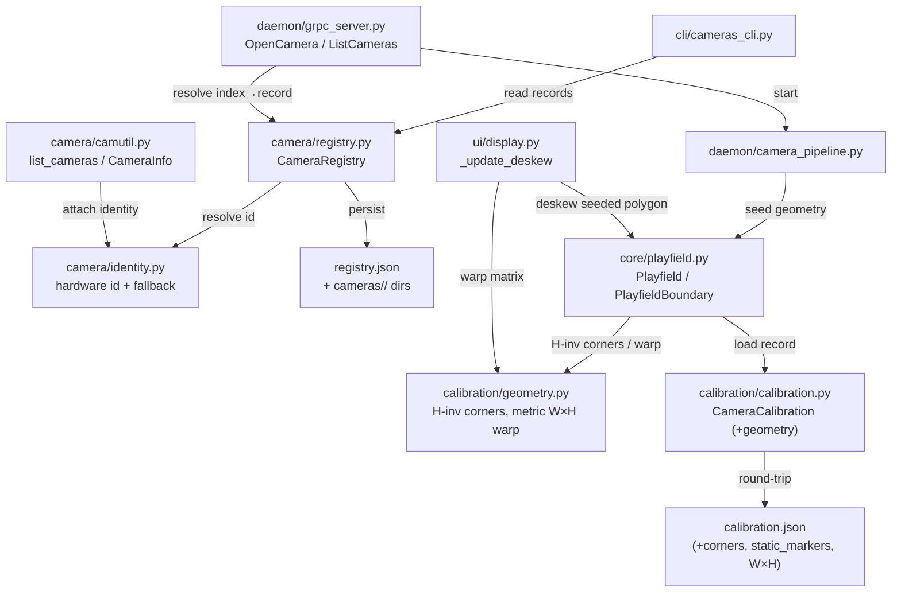

<!-- CLASI: Before changing code or making plans, review the SE process in CLAUDE.md -->

# Architecture Update -- Sprint 011: Static-Camera Deskew & Persistent Camera Registry

## What Changed

This sprint adds two persisted-state capabilities. They share the theme of
pushing per-camera state to disk so the daemon tolerates intermittent
detection and re-enumeration, but they are independent code paths.

### A. Persistent Camera Registry (foundational)

1. **New module `camera/registry.py` — `CameraRegistry`.**
   Owns an explicit, on-disk record of every camera ever seen. Responsibilities:
   capture a stable hardware id for a device, assign a monotonic enumeration
   number on first sight, look a camera up by id on reconnect and reuse its
   number + data dir, and report the merged view of registered (possibly
   offline) cameras against the live device list. One registry record per
   camera, stored under the existing `data/aprilcam/cameras/<id>/` layout plus a
   top-level index file `data/aprilcam/cameras/registry.json` mapping
   `unique_id → {enum, slug/dir, name, last_seen}`.

2. **New module `camera/identity.py` — hardware-id extraction.**
   A single function resolves the best-available stable id for a device, with a
   documented fallback chain:
   `AVFoundation uniqueID` / USB `serial` → `VID:PID + USB location-id` →
   USB `location path` (port) → name+resolution slug (last resort). Sources:
   `cv2-enumerate-cameras` (vid/pid/path where exposed) and, on macOS,
   `system_profiler SPCameraDataType` / `SPUSBDataType`. This module is the
   only place that shells out to `system_profiler`; it returns a plain
   dataclass and never imports OpenCV at module top.

3. **`camera/camutil.py` — extended `CameraInfo`.**
   `CameraInfo` gains optional identity fields (`unique_id`, `vid`, `pid`,
   `serial`, `location`) populated from the identity resolver. `list_cameras`
   attaches these when available. No behavior change when fields are absent.

4. **`daemon/grpc_server.py` `OpenCamera` — resolve through the registry.**
   Instead of `cam_name = device_name_slug(get_device_name(index))`, the
   handler asks the registry to resolve the OpenCV index → a registry record
   (creating one on first sight), and uses the record's stable per-camera dir
   key as `cam_name`. Reconnect of a known camera resolves to the same record
   and dir without a restart. The proto `OpenCameraResponse` is unchanged
   (`cam_name`, `camera_dir`); `cam_name` now derives from the registry key.

5. **`cli/cameras_cli.py` — registry-aware listing.**
   Lists all registry records, not just live devices. Each line shows the
   enumeration number; connected cameras show their current OS index,
   disconnected ones are rendered grayed-out (via `rich`, already a base dep)
   and marked offline. The pattern-selector still operates on connected
   cameras.

6. **Data-dir migration.** On first registry load, existing
   `data/aprilcam/cameras/<slug>/` directories are adopted into registry
   records (matched by slug; identity backfilled when the device is currently
   connected). No directory is renamed or orphaned in this sprint — the slug
   dir is retained as the record's dir key to keep `calibration.json`,
   `paths.json`, and `info.json` paths stable; the registry stores the mapping
   from `unique_id` to that existing dir.

### B. Homography-Derived Static Deskew (builds on persisted geometry)

7. **`calibration/calibration.py` — persist reference geometry.**
   `CameraCalibration` already carries `playfield_width_cm` /
   `playfield_height_cm` and `homography` but `to_dict`/`from_dict` currently
   drop the playfield block and never stored corner/static-marker pixels. This
   sprint extends the record (and its serialization) with:
   `playfield: {width, height}` (round-tripped), `corner_pixels` (the four
   calibration-time corner pixel positions), and `static_markers` (per-id
   `{pixel:[u,v], world:[x,y]}` for ArUco corners + AprilTag 1). These derive
   from data `calibrate_single` already computes (`pixel_pts`, `world_pts`,
   per-tag pixels) — it is a save-side capture, not new vision work.

8. **`calibration/geometry.py` — new pure-geometry helper (no I/O).**
   `corner_pixels_from_homography(H, width, height) -> (4,2)` maps world
   corners through `H⁻¹`; `metric_deskew_matrix(poly, width_cm, height_cm,
   px_per_cm) -> (3x3, (out_w, out_h))` builds the warp that maps the source
   polygon to a **metric top-down rectangle** sized `W×H` cm scaled by
   `px_per_cm`, returning both the matrix and the deterministic output
   resolution. `px_per_cm` is a configurable parameter with a sensible default
   chosen so the deskewed output is roughly the source resolution. This
   replaces the warp math currently duplicated in `PlayfieldBoundary.deskew` /
   `get_deskew_matrix` / `display._update_deskew` (which warped to a
   pixel-space rectangle sized by polygon edge lengths). Pure NumPy/OpenCV-math,
   no detection, no file access.

9. **`core/playfield.py` — seed polygon from saved geometry + static mode.**
   `PlayfieldBoundary` gains a "static-camera" path: when constructed with a
   seed polygon (already supported via `polygon=`) or with a saved homography +
   dimensions, it derives the deskew source polygon up front via
   `calibration/geometry.py`, so `get_polygon()` is non-`None` before any live
   detection. The deskew target is the metric `W×H` top-down rectangle (scaled
   by `px_per_cm`), so the source polygon plus the persisted dimensions fully
   determine the output. `update()` gains static-marker fill-in: static markers (ArUco
   corners + AprilTag 1, a configurable set) hold their stored pixel positions
   when not detected; dynamic AprilTags (ID ≠ 1) remain live-only. A
   movement-invalidation check compares live static-marker positions to stored
   ones and, beyond a threshold, drops the static assumption and raises a
   warning flag the pipeline surfaces.

10. **`core/playfield.py` `Playfield` — load geometry at construction.**
    When a calibration record is discovered (the existing `_auto_discover_*`
    path), `Playfield` passes the saved homography, dimensions, and
    static-marker pixels into `PlayfieldBoundary` so the static path activates
    automatically when a saved homography exists.

11. **`ui/display.py` `_update_deskew` — consume the seeded polygon.**
    The early-return-on-`None` logic is unchanged in shape, but because
    `get_polygon()` is now seeded from saved geometry, deskew engages without
    live corners. `_update_deskew` is refactored to call `metric_deskew_matrix`
    (shared helper) rather than duplicating the warp math, producing a metric
    top-down view at the configured `px_per_cm` resolution. Optional
    undistortion (saved `camera_matrix`/`dist_coeffs`) is
    applied to the frame before `warpPerspective` when static-camera mode is on
    and intrinsics exist.

## Why

| Change | Reason (use case) |
|--------|-------------------|
| `camera/registry.py` + `registry.json` | Daemon must survive unplug/replug without restart and remember disconnected cameras (SUC-006, SUC-007) |
| `camera/identity.py` fallback chain | Two identical-model cameras must be distinguishable; need stable id with graceful degradation (SUC-005) |
| `CameraInfo` identity fields | Carry identity from enumeration into the registry without a second probe (SUC-005) |
| `OpenCamera` registry resolution | Reconnect of a known camera resolves to the same number + dir, no restart (SUC-006) |
| Registry-aware `cameras` CLI | Show connected + previously-seen cameras with stable numbers (SUC-007) |
| Persist reference geometry | The data deskew needs (corners, static markers, W×H) must survive across runs (SUC-001, SUC-002) |
| `geometry.py` helper | Remove the duplicated warp math across 3 sites; provide `H⁻¹`-corner derivation and the metric `W×H` top-down warp (SUC-001) |
| Seed polygon + static mode | Deskew without live corners; tolerate flicker on static markers (SUC-001, SUC-002) |
| Movement invalidation | Never silently deskew with a stale transform after a bump (SUC-003) |
| Optional undistortion | Flatten residual barrel curvature when intrinsics exist (SUC-004) |

## Impact on Existing Components

| Component | Impact |
|-----------|--------|
| `camera/camutil.py` | `CameraInfo` gains optional identity fields; `list_cameras` attaches them. Backward compatible. |
| `camera/registry.py` | New module. |
| `camera/identity.py` | New module. Shells out to `system_profiler` on macOS; pure-stdlib elsewhere. |
| `daemon/grpc_server.py` | `OpenCamera` resolves `cam_name` via the registry instead of a bare slug. Proto unchanged. `CloseCamera`/info paths use the same key. |
| `daemon/camera_pipeline.py` | Receives the same `cam_name` (now a registry-stable key); no structural change. Consumes seeded geometry only through `Playfield`/`AprilCam`. |
| `cli/cameras_cli.py` | Listing reads the registry and renders offline cameras grayed-out. |
| `calibration/calibration.py` | `CameraCalibration.to_dict`/`from_dict` round-trip `playfield`, `corner_pixels`, `static_markers`. `calibrate_single`/`calibrate_secondary` capture them. Old files without the fields still load (defaults). |
| `calibration/geometry.py` | New pure-geometry module. |
| `core/playfield.py` | `PlayfieldBoundary` gains static-mode + fill-in + invalidation; `Playfield` seeds geometry at load. Live-corner path preserved as fallback. |
| `ui/display.py` | `_update_deskew` uses the shared metric-warp helper and the seeded polygon; output is a metric top-down view sized by `W×H` and `px_per_cm`; optional pre-warp undistortion. |
| `data/aprilcam/cameras/<slug>/` | Adopted into the registry; not renamed. New `registry.json` index added at `cameras/` root. |

## Migration Concerns

- **Calibration files**: new geometry fields are additive and optional;
  pre-existing `calibration.json` files load unchanged and gain the fields the
  next time calibration is saved. Where the homography + dimensions exist but
  corner pixels do not, the deskew path derives corners from `H⁻¹` at load — no
  recalibration required.
- **Camera data dirs**: existing slug dirs are adopted, not renamed, so
  `calibration.json` / `paths.json` / `info.json` paths are stable. The
  registry stores `unique_id → existing slug dir`. A genuinely new camera gets a
  fresh record.
- **Identity availability**: on platforms/devices without a serial, the
  fallback id is the USB location path; moving the same camera to a different
  USB port may present as a new camera. This limitation is documented in the
  identity module and the CLI help.
- **No proto/wire change**: `OpenCameraResponse` fields are unchanged, so
  existing clients are unaffected.

## Component Diagram



## Dependency Direction After This Sprint

```
[cli/]    --> [camera/registry] --> [camera/identity]            (presentation → domain)
[daemon/] --> [camera/registry] --> [camera/identity]
[camera/registry] --> [data files]                              (domain → infrastructure)
[daemon/camera_pipeline] --> [core/playfield] --> [calibration/geometry]
[core/playfield] --> [calibration/calibration] --> [data files]
[ui/display] --> [calibration/geometry]
[ui/display] --> [core/playfield]
```

No cycles. `calibration/geometry.py` is a leaf (pure math). `camera/identity.py`
is a leaf (id extraction). The registry depends only on identity + the
filesystem. Deskew consumers depend on the geometry leaf and the persisted
record, never the reverse.

## Design Rationale

### Decision: Adopt existing slug dirs rather than re-key to unique-id dirs

**Context**: The registry needs a per-camera dir. Options: (a) rename dirs to
`<enum>-<slug>` or `<unique_id>`, or (b) keep the existing `<slug>` dirs and
store the `unique_id → slug-dir` mapping in `registry.json`.

**Alternatives**:
1. Re-key directories to unique-id — cleaner long-term naming, but forces a
   filesystem migration of `calibration.json`/`paths.json`/`info.json` for
   every existing camera and risks orphaning data if the migration is partial.
2. Keep slug dirs, add an index (chosen) — zero filesystem churn, existing
   paths stay valid, identity lives in one index file.

**Why option 2**: The acceptance criterion is "existing data preserved or
migrated, not orphaned." Keeping the dirs and adding an index satisfies it with
the least risk. Two identical-model cameras (the collision case) get distinct
records via `unique_id`; their dirs can disambiguate with an enum suffix only
when an actual slug collision occurs, keeping the common case untouched.

**Consequences**: The dir name is not globally unique-id-based, but the
registry index is the source of truth for identity. A future sprint may
normalize dir naming if desired.

### Decision: Static deskew derives corners from `H⁻¹`, with persisted pixels as an optimization

**Context**: The deskew polygon can come from (a) the saved homography via
`H⁻¹ · world_corners`, or (b) persisted calibration-time corner pixels.

**Why both**: `H⁻¹` derivation needs only the homography + dimensions, which
every existing calibration already has — so deskew works with zero
recalibration. Persisting corner/static-marker pixels additionally enables the
fill-in and movement-invalidation features (which need the *measured* marker
pixels, not just the geometric corners) and removes a cold-start delay. The
`H⁻¹` path is the floor; persisted pixels are the richer path.

**Consequences**: Two code paths to seed the polygon, but both feed the same
`metric_deskew_matrix` helper, so the warp itself is single-sourced.

### Decision: Warp to a metric W×H top-down view (not a pixel-space rectangle)

**Context**: The deskew warp can target (a) a pixel-space rectangle sized by the
source polygon's edge lengths, or (b) a metric top-down rectangle sized by the
known playfield `W×H` cm. The original plan committed to (a) and left (b) as a
follow-up; the stakeholder reversed this.

**Why metric**: The homography and real-world `W×H` are already persisted, so a
metric target makes the deskewed output a deterministic function of the
playfield geometry rather than of whatever polygon the source happens to
present. Output pixels then map linearly to centimetres, which is what
downstream world-position consumers want. Because `W,H` are in cm, the warp
needs an output scale: a configurable `px_per_cm` (equivalently an output
resolution) with a default chosen so the deskewed output is roughly the source
resolution. `calibration/geometry.py` maps the world-cm corners
`(0,0),(W,0),(W,H),(0,H)` → output pixels at `px_per_cm`.

**Consequences**: Deskewed output dimensions are `(round(W·px_per_cm),
round(H·px_per_cm))` — deterministic given `W×H` and `px_per_cm`, independent of
the source polygon size. `px_per_cm` becomes a configuration parameter with a
sensible default. Pixel-space warping is dropped, not deferred.

### Decision: Configurable static-marker set, default `aruco_corners + apriltag:1`

**Context**: The stakeholder fixed the rule (static = all ArUco corners +
AprilTag 1; dynamic = every other AprilTag).

**Why configurable**: Other playfields may declare different fixed markers.
Encoding the rule as a default keeps this deployment correct while leaving the
boundary open. AprilTag 1 doubles as the movement sentinel because it sits away
from the frame edges and survives corner occlusion.

**Consequences**: The set lives in the per-camera calibration record (alongside
the geometry it pairs with), not in a global config, so each camera can carry
its own static set.

## Resolved Decisions

The four open questions from detail planning were reviewed by the stakeholder
and resolved as follows:

1. **Warp target = metric `W×H` top-down (CHANGED).** Deskew warps directly to a
   metric top-down view sized by the persisted playfield `W×H` cm, scaled by a
   configurable `px_per_cm` (default chosen so the deskewed output is roughly
   the source resolution). Pixel-space warping is dropped, not deferred. See the
   "Warp to a metric W×H top-down view" design rationale above. Affects
   `calibration/geometry.py`, `core/playfield.py`, and `ui/display.py`
   (tickets 005-007).
2. **USB-port-move identity = accepted limitation.** A serial-less camera moved
   to a different USB port may present as a new camera (the fallback
   location-path id changes). Accepted for this sprint and documented as a known
   limitation in `camera/identity.py` and the CLI help (tickets 001-003).
3. **Static-camera mode = auto-on when a saved homography exists, with a config
   override to disable.** Confirmed as already specified (ticket 007).
4. **Movement-invalidation surfacing = log warning + a stale-calibration flag in
   the camera's `info.json`; threshold is a config default.** Confirmed as
   already specified (ticket 006).
