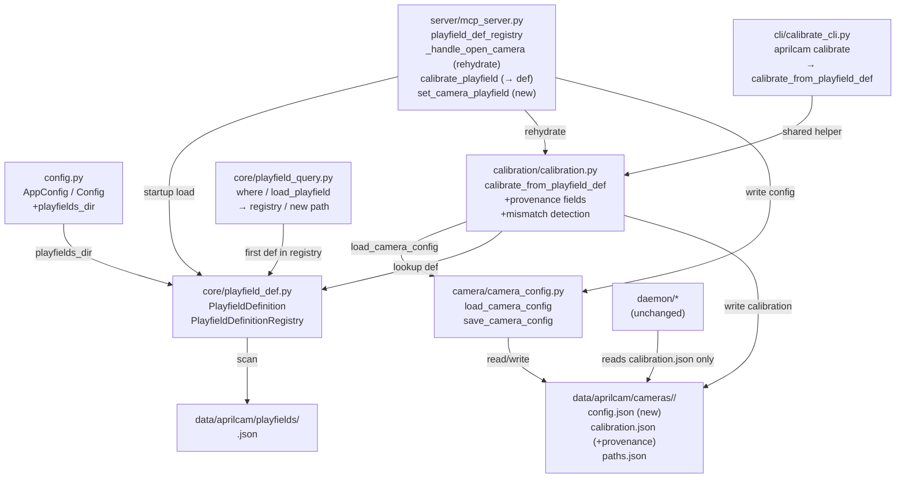
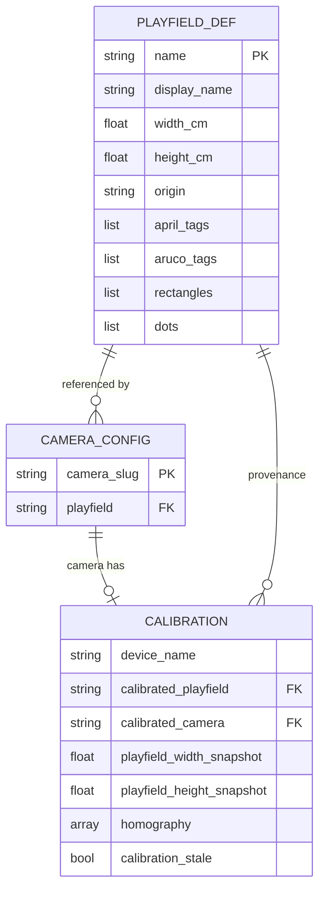

<!-- CLASI: Before changing code or making plans, review the SE process in CLAUDE.md -->

# Architecture Update -- Sprint 012: Named Persistent Playfields as Single Source of Truth

## What Changed

This sprint introduces the playfield definition as the single authoritative source
of field geometry and establishes a formal camera-to-playfield link. Three
structural changes work together:

### 1. PlayfieldDefinition model + PlayfieldDefinitionRegistry (new)

**New module `src/aprilcam/core/playfield_def.py`.**

`PlayfieldDefinition` is a dataclass loaded from `data/aprilcam/playfields/<slug>.json`.
It exposes:
- Identity: `name` (== filename stem), `display_name` (optional).
- Geometry: `width_cm`, `height_cm`, `origin` (string tag).
- Marker lists: `april_tags`, `aruco_tags`, `rectangles`, `dots` (raw dicts as in
  the JSON).
- Computed helpers: `corner_aruco_ids()` — the four diagonal-cardinal ArUco IDs
  (northwest/northeast/southeast/southwest) and `corner_world_coords()` — their
  `(x, y)` world positions in the def's center-origin frame.

`PlayfieldDefinitionRegistry.load_all(playfields_dir)` scans `*.json` files in
the directory and builds a `{name: PlayfieldDefinition}` map. Modeled on the
existing `PathRegistry` / `PlayfieldRegistry` pattern (no I/O at attribute
access; loaded once at startup).

The `where` tool and `playfield_query.load_playfield` are repointed to load from
the registry's first entry (or by name when one is active). A backward-compat
fallback to the old `data/aprilcam/playfield.json` path is kept during migration.

### 2. Per-camera config helpers (new)

**New module `src/aprilcam/camera/camera_config.py`.**

Two functions:
- `load_camera_config(camera_dir) -> dict | None` — reads
  `<camera_dir>/config.json`; returns the dict or `None` if absent. Uses
  standard JSON; never raises on missing file.
- `save_camera_config(camera_dir, config_dict)` — writes atomically via
  `.tmp` + `os.replace`.

The daemon (`camera_pipeline.py`, `grpc_server.py`) never imports or writes to
this module. Its output (`config.json`) is owned exclusively by the MCP server
and human operators.

**`src/aprilcam/config.py` extended:**
- Add `playfields_dir` property returning `self.data_dir / "playfields"`.
- No new env var; the dir is always `<data_dir>/playfields/`.

### 3. Calibration refactor — shared helper, precondition, provenance

**`src/aprilcam/calibration/calibration.py` changes:**

A. **New shared function `calibrate_from_playfield_def`:**
   - Accepts: `camera_dir`, `cap` (VideoCapture-compatible), `playfield_def_registry`,
     `camera_slug`, optional `camera_position`, `num_frames`.
   - Resolves `load_camera_config(camera_dir)` → playfield slug.
   - Fetches `PlayfieldDefinition` from the registry.
   - If either step fails → raises `PlayfieldConfigError` with the guidance
     message (exact text: `"Camera '<slug>' has no playfield configured. Create
     data/aprilcam/cameras/<slug>/config.json with {\"playfield\": \"<name>\"}.
     Available playfields: [<names>]"`).
   - Reads corner ArUco IDs + world coords from def; passes them to the existing
     `_assign_corners_by_position` (or a new def-aware variant) for detection;
     computes homography.
   - Writes `calibration.json` with:
     - `playfield: {"width": width_cm, "height": height_cm}` (derived snapshot).
     - `calibrated_playfield: "<slug>"`, `calibrated_camera: "<slug>"` (provenance).
     - All existing homography / camera_matrix / dist_coeffs / static_markers
       fields as before.
   - Returns `CameraCalibration` with the new provenance fields populated.

B. **`CameraCalibration` gains two new optional fields:**
   - `calibrated_playfield: Optional[str]` — the playfield slug at calibration time.
   - `calibrated_camera: Optional[str]` — the camera slug at calibration time.
   Both are serialized/deserialized in `to_dict` / `from_dict`; `None` for legacy records.

C. **`load_calibration_from_camera_dir` extended:**
   Accepts optional `camera_config: dict | None` and `playfield_def:
   PlayfieldDefinition | None`. When both are provided:
   - Compares `calibrated_playfield` against `camera_config["playfield"]`.
   - Compares stored `playfield.width` / `playfield.height` against `def.width_cm`
     / `def.height_cm`.
   - Sets a new `calibration_stale: bool` attribute on the returned
     `CameraCalibration` when a mismatch is detected; logs a warning.
   Legacy records (no `calibrated_playfield`) are always marked stale when a
   linked def is known, because they predate provenance tracking.

D. **`_assign_corners_by_position` receives a new def-aware variant:**
   When called with explicit `corner_ids` and `corner_world_coords` from a def,
   it looks up those specific ArUco IDs (positive integers in the def, stored as
   negative tids in the detection dict) rather than testing the hardcoded 0-3 /
   1-8 canonical layouts. The old canonical-layout paths remain as fallback when
   no def is available (used by `create_playfield` without a linked def).

E. **`calibrate_playfield` MCP tool signature change:**
   `width` and `height` parameters become optional with default `None`. When the
   camera has a `config.json`, they are ignored (dimensions come from def).
   When no `config.json`, the hard error is raised rather than using the supplied
   values. This is a behavioral breaking change for unconfigured cameras — they
   must now be configured first.

F. **`aprilcam calibrate` CLI change:**
   `--width` and `--height` flags remain for documentation but are now ignored when
   a `config.json` is found. The calibration loop calls `calibrate_from_playfield_def`
   instead of `calibrate_single`. The field-dimension default-loading block
   (reading from any existing `calibration.json`) is removed — dims come from the
   def only.

### 4. `_handle_open_camera` rehydration (changed)

After the existing daemon open call, `_handle_open_camera` attempts auto-rehydration:
1. Load `config.json` from `camera_dir` → playfield slug.
2. Lookup `PlayfieldDefinition` from the module-level `playfield_def_registry`.
3. Call `load_calibration_from_camera_dir(camera_dir, camera_config, playfield_def)`.
4. If calibration loaded (with or without staleness): construct a `PlayfieldEntry`
   with `field_spec` from the def and the stored `homography`; register in
   `playfield_registry`.
5. If calibration is stale: include `"calibration_stale": true` in the
   `open_camera` response.
6. If no `config.json` or no calibration: skip rehydration silently (camera opens
   without a playfield; agent must call `create_playfield` or `calibrate_playfield`).

The existing `_handle_create_playfield` fallback path (which loads calibration
when live corner detection fails) remains; in that path, corner world coords now
come from the def when a def is linked (replacing the hardcoded
0,0..W,H rectangle).

### 5. MCP server startup: PlayfieldDefinitionRegistry (changed)

At the module's top-level instance block (after line 235 in the current file),
add:
```python
playfield_def_registry = PlayfieldDefinitionRegistry()
```

In `mcp_server.main()` (or in a `@server.on_startup` hook), call:
```python
playfield_def_registry.load_all(Config.load().playfields_dir)
```

The registry is a module-level singleton accessible to all tool handlers.

### 6. (Optional) `set_camera_playfield` MCP tool (new, Ticket 006)

New tool that writes `config.json` for a camera:
- Validates that the named playfield exists in the registry.
- Writes `{"playfield": "<slug>"}` atomically.
- Does not trigger re-calibration.
- Allows agents to wire a camera without hand-editing files.

---

## Why

| Change | Reason (use case) |
|--------|-------------------|
| `playfield_def.py` + `PlayfieldDefinitionRegistry` | Playfield geometry must be loaded from a named file at startup, not passed as ad-hoc parameters (SUC-001, SUC-002, SUC-005) |
| `camera_config.py` helpers | Formal camera→playfield link; daemon boundary preserved (daemon never reads/writes `config.json`) (SUC-002, SUC-003) |
| `Config.playfields_dir` | Standard Config access pattern for all path resolution (SUC-001, SUC-002) |
| `calibrate_from_playfield_def` shared helper | One code path for both MCP and CLI; enforces def as source of truth; prevents dimension mismatch (SUC-002, SUC-003) |
| `CameraCalibration` provenance fields | Enable mismatch detection without re-calibration; explicit audit trail (SUC-004) |
| Mismatch detection in `load_calibration_from_camera_dir` | Surface stale-calibration flag rather than silently using wrong geometry (SUC-004) |
| `_handle_open_camera` rehydration | Eliminate per-session `create_playfield` calls; normal workflow requires no setup beyond `open_camera` (SUC-001) |
| `calibrate_playfield` signature change | Remove user-supplied dimensions; def is the only source of truth (SUC-002) |
| CLI calibrate using shared helper | Ensure CLI and MCP never diverge on calibration logic (SUC-002, SUC-003) |
| Data migration (Ticket 003) | Adopt new layout; link three existing cameras to main-playfield (SUC-005) |
| `set_camera_playfield` tool | Ergonomic: agent-visible way to create `config.json` without file editing (SUC-001) |

---

## Impact on Existing Components

| Component | Impact |
|-----------|--------|
| `core/playfield_def.py` | New module. No callers yet at sprint start. |
| `camera/camera_config.py` | New module. Called by `calibration.py` shared helper and `mcp_server.py` rehydrate path. |
| `config.py` | `playfields_dir` property added. Backward-compatible. |
| `calibration/calibration.py` | `CameraCalibration` gains 2 new optional fields; `calibrate_from_playfield_def` function added; `load_calibration_from_camera_dir` extended with optional mismatch detection. Legacy records load unchanged. |
| `calibration/calibration.py` `_assign_corners_by_position` | New def-aware call path; old canonical-layout paths remain as fallback. |
| `server/mcp_server.py` | Module-level `playfield_def_registry` added. `_handle_open_camera` gains rehydration block. `calibrate_playfield` tool: `width`/`height` become optional. |
| `cli/calibrate_cli.py` | Default-loading block removed; each camera path calls `calibrate_from_playfield_def` instead of `calibrate_single`. `--width`/`--height` flags remain but are superseded by def. |
| `core/playfield_query.py` | `load_playfield` / `default_playfield_path` updated to use registry / new `playfields/` path; old path kept as backward-compat fallback. |
| `daemon/camera_pipeline.py` | No change. Daemon boundary respected. |
| `daemon/grpc_server.py` | No change. |
| `data/aprilcam/` | New `playfields/` subdirectory. Three cameras gain `config.json`. |
| `data/aprilcam/cameras/*/calibration.json` | Existing files: no structural change; gain provenance fields on next save. Flagged stale on load (missing `calibrated_playfield`) when a linked def is present. |

---

## Migration Concerns

### Coordinate-system change (center origin) — stakeholder accepted

The def uses the center-origin frame (AprilTag A1 = 0,0; X east, Y north). The
old `calibration.json` files used a corner origin (UL = 0,0). All three existing
calibrations are wrong-by-construction and must be re-run. Existing `paths.json`
entries are in the old coordinate frame and are cleared as part of the migration
(Ticket 003). This consequence is explicitly accepted by the stakeholder.

### Corner ArUco IDs change

The old calibration code uses hardcoded IDs 0-3 (or 1-8) for corners. The def
specifies IDs 1/3/5/7 (diagonal-cardinals: northwest/northeast/southwest/
southeast). The new `calibrate_from_playfield_def` helper reads IDs from the def;
no physical field marker changes are needed (the markers are already on the field
with IDs 1/3/5/7 — the def is authoritative).

### `calibrate_playfield` tool backward incompatibility

The `width` and `height` parameters will be ignored (not an error) when a
`config.json` is found, and will raise `PlayfieldConfigError` when no
`config.json` is found. Existing agent workflows that call
`calibrate_playfield(width=..., height=...)` on a configured camera continue to
work (dimensions simply come from the def). Workflows on unconfigured cameras
must now create `config.json` first.

### `aprilcam calibrate` CLI backward incompatibility

The CLI no longer loads field dimensions from existing `calibration.json` files as
defaults. Each camera must have a `config.json` referencing a playfield before
calibration succeeds. The migration ticket writes `config.json` for the three
known cameras; any new camera must be configured manually or via
`set_camera_playfield`.

### Startup load order

The `playfield_def_registry.load_all()` call must complete before any tool that
calls `_handle_open_camera` or `calibrate_playfield`. The FastMCP framework
provides an `on_startup` hook; this is the appropriate place. If no
`playfields/` directory exists, the registry loads empty and the server degrades
gracefully (rehydration skips with a warning; calibration raises `PlayfieldConfigError`
listing zero available playfields).

---

## Component Diagram



## Entity-Relationship Diagram



---

## Design Rationale

### Decision: Single shared calibration helper (`calibrate_from_playfield_def`)

**Context:** Two entry points (MCP `calibrate_playfield` and `aprilcam calibrate`
CLI) both need to: resolve config → def → geometry → homography → save with
provenance. Duplication risks divergence (as happened with the current
width/height mismatch between the def and per-camera calibration.json).

**Alternatives considered:**
1. Keep both paths independent, add matching logic in each.
2. Single helper called by both (chosen).

**Why option 2:** Correctness is more important than minor call-site flexibility.
Divergence between MCP and CLI calibration is a known risk (explicitly listed in
the issue). A single function is the only structural guarantee. Both callers
pass the same `_DaemonCapture`-compatible object, so the interface is already
unified.

**Consequences:** The CLI loses some flexibility (can no longer override dimensions
from a flag). This is intentional — dimensions come from the def only.

### Decision: `calibration_stale` as an in-memory flag, not a field written to disk

**Context:** When mismatch is detected on load, the options are (a) write a
`"stale": true` field back into `calibration.json`, or (b) surface the flag
only on the `CameraCalibration` object returned from load, never written.

**Why (b):** Writing back would make the load function a writer, which violates
the read/write separation. The flag is transient state: after recalibration, the
new `calibration.json` has matching provenance and the flag goes away. Persisting
it would require cleanup logic. The caller (rehydrate path) includes it in the
`open_camera` response; the agent decides what to do.

**Consequences:** `calibration_stale` must be set before returning from
`load_calibration_from_camera_dir`; callers cannot infer it from the file alone.

### Decision: Preserve `create_playfield` as a bootstrap path, not replace it

**Context:** `create_playfield` currently does live corner detection + fallback to
stored calibration. The new rehydration path in `open_camera` supersedes the
stored-calibration fallback for normal use. Two options: (a) remove
`create_playfield`, or (b) keep it.

**Why (b):** `create_playfield` remains useful for first-time setup on a camera
with no stored calibration — it performs live corner detection without requiring
a prior calibration. Removing it would break the initial-setup workflow. After
this sprint, `create_playfield` is a bootstrap tool; `open_camera` handles the
steady-state case.

**Consequences:** Two paths create a `PlayfieldEntry`. The rehydration path in
`open_camera` should check whether one was already created by `create_playfield`
for the same camera and avoid overwriting it.

### Decision: `playfields_dir` as a property on `Config`, not an env var

**Context:** Two options: (a) `APRILCAM_PLAYFIELDS_DIR` env var with property, or
(b) derived property `data_dir / "playfields"` with no env var.

**Why (b):** The playfields directory is always co-located with the data directory.
Adding an env var for it adds configuration surface without benefit. If
`APRILCAM_DATA_DIR` changes, playfields move with it, which is the correct
behavior. An env var would allow misconfiguration (playfields dir outside data
dir). The simple property is the right level of abstraction.

**Consequences:** Cannot place playfields outside the data dir without subclassing
`Config`. Acceptable for the foreseeable use case.

---

## Risks and Accepted Consequences

| Risk | Mitigation / Status |
|------|---------------------|
| All existing calibrations are invalidated (center-origin change) | Accepted by stakeholder. Migration ticket clears stale paths.json. Mismatch warning fires on next open_camera. |
| Corner ArUco IDs change from 0-3 to 1/3/5/7 | IDs in the def match the physical field markers. The shared helper reads IDs from the def, not hardcoded. Verified in tests. |
| Two calibrate entry points diverge | Prevented structurally: both call `calibrate_from_playfield_def`. Enforced by a unit test that imports the same helper from both call sites. |
| Daemon boundary: daemon must never write config.json | Confirmed: `camera_pipeline.py` writes only `info.json`; `grpc_server.py` writes only calibration via `reload_calibration`. No changes to daemon. |
| `calibrate_playfield` API change breaks callers that supply width/height | Low impact: existing callers on configured cameras continue to work (params ignored). Unconfigured cameras now receive a hard error with instructions. |
| Startup failure if `playfields/` missing | Registry loads empty; server starts but rehydration skips and calibration raises a clear error. Degradation is graceful. |

## Open Questions

None. All design decisions are resolved per stakeholder approval of the linked
issue. Accepted consequences are listed in Risks above, not as open questions.
