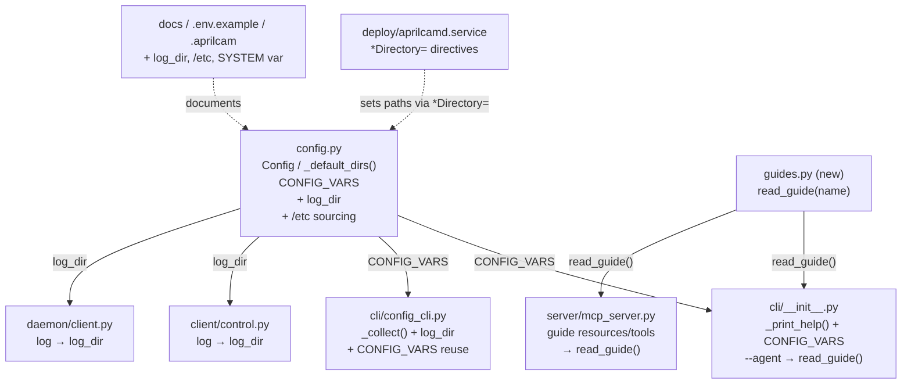
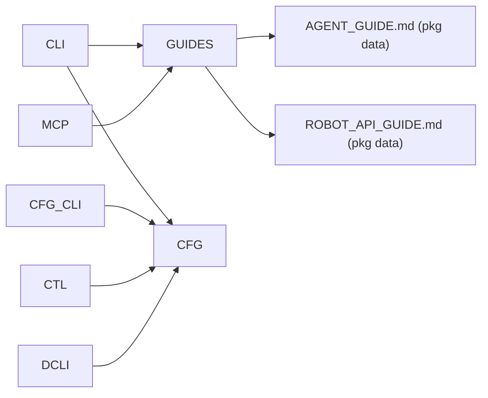

<!-- CLASI: Before changing code or making plans, review the SE process in CLAUDE.md -->

# Architecture Update -- Sprint 013: FHS/XDG Directories, /etc Config Sourcing, --help & --agent

## What Changed

### 1. `config.py` — `/etc` sources, `_default_dirs()`, `log_dir`, `CONFIG_VARS`

**`Config.load()` gains two new lowest-priority sources** (inserted before
`~/.aprilcam`):

```
Priority (lowest first → highest wins):
  0a. /etc/aprilcam.env
  0b. /etc/aprilcam/aprilcam.env
  1.  ~/.aprilcam
  2.  .aprilcam  (walk up from start)
  3.  .env       (walk up from start, via dotenv)
  4.  APRILCAM_* process env
```

Both `/etc` files are parsed with the existing `_parse_dotfile()` helper.
Missing files are silently ignored (no error).

**New `_default_dirs()` module-level function** (not a method):

```python
def _default_dirs() -> tuple[Path, Path, Path, Path]:
    """Return (data_dir, socket_dir, log_dir, config_dir) based on euid/APRILCAM_SYSTEM."""
```

Selection logic:
- FHS mode: when `os.geteuid() == 0` OR `os.environ.get("APRILCAM_SYSTEM") == "1"`.
- XDG mode: otherwise (including when `APRILCAM_SYSTEM=0` even for root).

| Concern | FHS (root/SYSTEM=1) | XDG (non-root) |
|---------|---------------------|----------------|
| data_dir | `/var/lib/aprilcam` | `$XDG_DATA_HOME/aprilcam` or `~/.local/share/aprilcam` |
| socket_dir | `/run/aprilcam` | `$XDG_RUNTIME_DIR/aprilcam` or `/run/user/<uid>/aprilcam` |
| log_dir | `/var/log/aprilcam` | `$XDG_STATE_HOME/aprilcam` or `~/.local/state/aprilcam` |
| config_dir | `/etc/aprilcam` | `$XDG_CONFIG_HOME/aprilcam` or `~/.config/aprilcam` |

`_default_dirs()` is a pure function: it reads environment variables and
`os.geteuid()` but does not call `Config.load()` and does not perform any I/O.

**`Config` dataclass gains `log_dir` field:**

```python
log_dir: Path = field(default_factory=lambda: Path("~/.local/state/aprilcam").expanduser())
```

In `Config.load()`, `log_dir` is resolved from `APRILCAM_LOG_DIR` or the
`_default_dirs()` result. All three directory fields (`data_dir`, `socket_dir`,
`log_dir`) are `mkdir`'d at load with a guarded `except PermissionError` that
emits a clear message:

```
aprilcam: cannot create <dir> (permission denied).
  For system installs, let systemd create the directory with:
    StateDirectory=aprilcam       # → /var/lib/aprilcam
    RuntimeDirectory=aprilcam     # → /run/aprilcam
    LogsDirectory=aprilcam        # → /var/log/aprilcam
```

**`CONFIG_VARS` constant** — a module-level list of dicts, one per documented
`APRILCAM_*` variable:

```python
CONFIG_VARS: list[dict] = [
    {"key": "APRILCAM_DATA_DIR",              "default": "(FHS/XDG auto)", "description": "..."},
    {"key": "APRILCAM_SOCKET_DIR",            "default": "(FHS/XDG auto)", "description": "..."},
    {"key": "APRILCAM_LOG_DIR",               "default": "(FHS/XDG auto)", "description": "..."},
    {"key": "APRILCAM_LOG_LEVEL",             "default": "INFO",           "description": "..."},
    {"key": "APRILCAM_DAEMON_PIDFILE",        "default": "<socket_dir>/aprilcamd.pid", "description": "..."},
    {"key": "APRILCAM_DETECTION_FPS",         "default": "10",             "description": "..."},
    {"key": "APRILCAM_STATIC_DESKEW",         "default": "1",              "description": "..."},
    {"key": "APRILCAM_DESKEW_PX_PER_CM",      "default": "0",              "description": "..."},
    {"key": "APRILCAM_UNDISTORT",             "default": "0",              "description": "..."},
    {"key": "APRILCAM_MOVEMENT_THRESHOLD_PX", "default": "0",              "description": "..."},
    {"key": "APRILCAM_SYSTEM",                "default": "auto",           "description": "Force FHS (1) or XDG (0) directory layout regardless of euid."},
]
```

`APRILCAM_DAEMON_HOST` and `APRILCAM_DAEMON_PORT` may optionally be added as
stub entries (with a "reserved for Sprint 014" note) if the Config fields are
added now; otherwise they are omitted from `CONFIG_VARS` in this sprint.

The Config docstring precedence list (`:236-240`) is updated to include the
`/etc` sources.

---

### 2. `client/control.py` and `daemon/client.py` — log path migration

Both spawner sites (`client/control.py:128`, `daemon/client.py:153`) change:

```python
# Before
log_file = open(config.data_dir / "aprilcamd.log", "a")

# After
config.log_dir.mkdir(parents=True, exist_ok=True)
log_file = open(config.log_dir / "aprilcamd.log", "a")
```

No other changes to these files.

---

### 3. `cli/__init__.py` — `_print_help()` expansion and `--agent` flag

**`_print_help()` expanded** with two new sections after the subcommand list:

```
Configuration:
  Source precedence (lowest to highest):
    /etc/aprilcam.env · /etc/aprilcam/aprilcam.env · ~/.aprilcam
    .aprilcam · .env · APRILCAM_* environment variables

  Run 'aprilcam config' to see all resolved paths and values.

Environment variables:
  APRILCAM_DATA_DIR          (FHS/XDG auto)  Root for persistent state ...
  APRILCAM_SOCKET_DIR        (FHS/XDG auto)  Unix socket and pidfile dir ...
  ...
```

The variable table is generated by iterating `CONFIG_VARS` (imported from
`config.py`). No duplication of variable metadata in `cli/__init__.py`.

**`main()` gains `--agent` flag** parsed before the subcommand dispatch:

```python
if args[0] == "--agent":
    guide = args[1] if len(args) > 1 else "agent"
    from aprilcam.guides import read_guide
    content = read_guide(guide)
    if content is None:
        print(f"Unknown guide: {guide!r}. Available: agent, robot", file=sys.stderr)
        sys.exit(1)
    print(content)
    sys.exit(0)
```

`--agent` is listed in the help output under the existing flags section.

---

### 4. New module `src/aprilcam/guides.py`

Small module with a single public function:

```python
def read_guide(name: str) -> str | None:
    """Return the text of a packaged guide file, or None if unknown.

    name: "agent" → AGENT_GUIDE.md
          "robot" → ROBOT_API_GUIDE.md
    """
```

The function resolves the package directory as `Path(__file__).parent` and
reads the `.md` file. Returns `None` for unrecognized names.

This module is imported by:
- `cli/__init__.py` (for `--agent`)
- `server/mcp_server.py` (replacing inline `(_PACKAGE_DIR / ...).read_text()`)

The `_PACKAGE_DIR` constant in `mcp_server.py` is removed; both resource
callbacks and the `get_robot_api_guide` tool delegate to `read_guide()`.

---

### 5. `cli/config_cli.py` — `CONFIG_VARS` reuse and layout display

`config_cli.py` is updated to:
- Import `CONFIG_VARS` from `config.py`.
- Show a "Directory layout" section in the table output that labels each path
  with its concern (data, runtime, log).
- The `_collect()` function gains `log_dir`.
- Optionally add a `--vars` flag to print the raw `CONFIG_VARS` table for
  debugging.

---

### 6. `src/aprilcam/AGENT_GUIDE.md`

Refreshed to include:
- A "Directory layout" section summarizing the FHS/XDG table.
- A note that `aprilcam --agent` prints this guide to stdout.
- No other structural changes to guide content.

---

### 7. `deploy/aprilcamd.service` (new file)

New systemd unit file at `deploy/aprilcamd.service`:

```ini
[Unit]
Description=AprilCam tag-detection daemon
After=network.target

[Service]
Type=simple
ExecStart=/usr/local/bin/aprilcam daemon start --foreground
Restart=on-failure
RestartSec=5

# systemd creates these directories with correct ownership before ExecStart.
# When running as a system user, the daemon detects euid != 0 only if
# DynamicUser is true — use APRILCAM_SYSTEM=1 to force FHS layout if needed.
ConfigurationDirectory=aprilcam
StateDirectory=aprilcam
RuntimeDirectory=aprilcam
LogsDirectory=aprilcam
StandardOutput=journal
StandardError=journal

[Install]
WantedBy=multi-user.target
```

The service uses `DynamicUser=yes` or a dedicated `aprilcam` system user
(operator's choice). When using `DynamicUser=yes`, set `APRILCAM_SYSTEM=1`
in the unit's `Environment=` because `DynamicUser` does not set euid 0 but
still requires FHS paths.

---

### 8. Docs and dotfile updates

- `.env.example` — add `APRILCAM_LOG_DIR`, `APRILCAM_SYSTEM`; update
  default comments for `APRILCAM_DATA_DIR` and `APRILCAM_SOCKET_DIR` to
  reflect FHS/XDG auto-selection.
- `.aprilcam` — update the loading-priority comment to include `/etc` sources.
- `docs/wiki/daemon-interface.md` — update the env-var table (lines 272-277)
  to include all `CONFIG_VARS` entries including `APRILCAM_LOG_DIR` and
  `APRILCAM_SYSTEM`; update the precedence table to include `/etc` rows.

---

## Why

| Change | Reason |
|--------|--------|
| `/etc` config sourcing | System operators need a global config file without per-user dotfile injection (SUC-003) |
| `_default_dirs()` FHS/XDG | Production daemon needs reboot-safe, FHS-correct directories; developers need zero-config non-root use (SUC-001, SUC-002) |
| `log_dir` field | Logs belong in `/var/log` (FHS) or `~/.local/state` (XDG), not alongside persistent calibration data (SUC-001, SUC-002) |
| `CONFIG_VARS` single source | Prevent documentation drift between `--help`, `aprilcam config`, wiki, and `.env.example` (SUC-004) |
| `_print_help()` expansion | Self-documenting CLI — operators discover variables without reading source (SUC-004) |
| `--agent` flag + `read_guide()` | Agent instructions accessible from any shell context; DRY with MCP server guide tools (SUC-005) |
| `deploy/aprilcamd.service` | Formal systemd integration; Sprint 014 TCP-daemon unit inherits these `*Directory=` directives |

---

## Impact on Existing Components

| Component | Impact |
|-----------|--------|
| `config.py` | New fields (`log_dir`), new function (`_default_dirs()`), new constant (`CONFIG_VARS`), new `/etc` source parsing in `load()`. Backward-compatible: existing `APRILCAM_*` overrides work unchanged. Default paths change for fresh installs. |
| `client/control.py` | Log path: `data_dir / "aprilcamd.log"` → `log_dir / "aprilcamd.log"`. One-line change at :128. |
| `daemon/client.py` | Same log-path change at :153. |
| `cli/__init__.py` | `_print_help()` output extended (additive). `main()` gains `--agent` branch before dispatch (additive). |
| `cli/config_cli.py` | `_collect()` gains `log_dir`. Imports `CONFIG_VARS`. Minor additive changes. |
| `server/mcp_server.py` | `_resource_robot_api`, `_resource_agent_guide`, `get_robot_api_guide` delegate to `read_guide()` instead of inline `.read_text()`. `_PACKAGE_DIR` usage reduced. Behavior unchanged. |
| `src/aprilcam/guides.py` | New module. No external callers beyond the two listed above. |
| `src/aprilcam/AGENT_GUIDE.md` | Content updated (directory layout section, `--agent` mention). Not a code change. |
| `deploy/aprilcamd.service` | New file. No impact on existing code. |
| Test suite | New `tests/test_config_fhs_xdg.py`; existing `tests/test_config_loader.py` updated. |

---

## Migration Concerns

### Default path changes for existing installs

Existing installations that rely on the cwd-relative `./data/aprilcam/`
default (no `APRILCAM_DATA_DIR` set) will see a different default path after
this sprint. Two cases:

1. **Root / system install**: Default changes from `./data/aprilcam/` to
   `/var/lib/aprilcam/`. If state already exists under `./data/aprilcam/`,
   the operator must either set `APRILCAM_DATA_DIR=./data/aprilcam/` to
   preserve the old location, or migrate files manually.
2. **Developer (non-root)**: Default changes from `./data/aprilcam/` to
   `~/.local/share/aprilcam/`. Same options as above.

Mitigation: The project's working `.aprilcam` file already sets explicit
`APRILCAM_DATA_DIR` values for development machines, so those are unaffected.
Production deploys via the new systemd unit use `StateDirectory=aprilcam`
which creates `/var/lib/aprilcam` automatically; no migration needed for
fresh deploys. The issue notes that existing `/home/eric/aprilcam-data` style
paths in any current systemd unit should be replaced with `APRILCAM_DATA_DIR`
pointing to the migrated location.

### Log file location change

`aprilcamd.log` moves from `<data_dir>/aprilcamd.log` to
`<log_dir>/aprilcamd.log`. Any monitoring or log-rotation config pointing at
the old path must be updated. The systemd unit uses `StandardOutput=journal`,
making the log file optional for system installs.

### `socket_dir` default change for non-root

Non-root default changes from `/tmp/aprilcam/` to `$XDG_RUNTIME_DIR/aprilcam`.
Existing connections using the old path will break. Set `APRILCAM_SOCKET_DIR`
to preserve the old path.

### Backward-compatible guarantees

- All `APRILCAM_*` environment overrides continue to work and take precedence
  over the new `_default_dirs()` results.
- The dotfile loading order for `.aprilcam`, `.env`, and `~/.aprilcam` is
  unchanged; `/etc` is inserted below all of them.
- No changes to the daemon wire protocol, calibration file formats, or MCP
  tool signatures.

---

## Component Diagram



## Dependency Graph



---

## Design Rationale

### Decision: `_default_dirs()` as a pure function, not a `Config` classmethod

**Context:** The default directory values must be computable before `Config.load()`
has merged all sources. If `_default_dirs()` were a classmethod that called
`load()`, it would recurse.

**Alternatives considered:**
1. Inline the euid/XDG logic directly inside `Config.load()`.
2. Pure function called from `load()` (chosen).

**Why option 2:** Testability. A pure function can be tested in isolation with
`monkeypatch.setattr(os, "geteuid", lambda: 0)` and `monkeypatch.setenv`. Inlining
would require constructing a full `Config` object to test the selection logic.

**Consequences:** `_default_dirs()` is called once per `Config.load()` invocation,
only when the user has not explicitly set `APRILCAM_DATA_DIR`/`APRILCAM_SOCKET_DIR`/
`APRILCAM_LOG_DIR`.

---

### Decision: `CONFIG_VARS` as a list of dicts in `config.py`

**Context:** Three consumers need the same variable metadata: `_print_help()`,
`config_cli.py`, and potentially automated doc generation. Options: (a) duplicate
in each consumer, (b) single source in `config.py`, (c) separate metadata module.

**Why option (b):** `config.py` already owns the field definitions; placing
metadata alongside them minimizes the chance of drift when fields are added or
renamed. A separate module would require a circular-import guard (the module
would need to import `Config` to cross-check). A list of dicts is simpler than
a named-tuple registry for this use case.

**Consequences:** Any new `APRILCAM_*` variable requires a corresponding
`CONFIG_VARS` entry. The test `test_config_vars_coverage` enforces this by
asserting that every field with an `APRILCAM_` comment in `config.py` has a
matching entry.

---

### Decision: `read_guide()` in a new `guides.py` module, not in `cli/__init__.py` or `mcp_server.py`

**Context:** The guide files must be readable by both the CLI and the MCP server.
Placing the helper in `cli/__init__.py` would require `mcp_server.py` to import
from the CLI layer, inverting the dependency direction. Placing it in
`mcp_server.py` would require the CLI to import the full server stack.

**Why `guides.py`:** A small utility module with no heavy imports sits below both
the CLI and server layers. Both can import it freely. It has no dependency on
`Config`, `FastMCP`, or OpenCV.

**Consequences:** New module to maintain; but it is intentionally tiny (~15 lines).

---

### Decision: Permission errors on `mkdir` are caught and re-raised with an actionable message, not silently ignored

**Context:** When running under a system user without the `*Directory=` systemd
directives, `mkdir("/var/log/aprilcam")` will fail with `PermissionError`.
Options: (a) silently ignore and let the log open fail later, (b) fall back
to the XDG path, (c) raise with a clear message.

**Why option (c):** Silent fallback would cause the daemon to run with unexpected
paths, making debugging harder. A clear error message pointing to the systemd
unit directives gives the operator an actionable fix and prevents misconfiguration.
The error is raised at load time, not at first log write, so it surfaces immediately.

**Consequences:** Operators who use FHS defaults without systemd will see an error
on startup. They must either pre-create the directory, use the systemd unit, or
set `APRILCAM_SYSTEM=0` to use XDG paths.

---

## Open Questions

None. All design decisions are resolved per the stakeholder-approved issue file.
The `/etc/aprilcam/aprilcam.env` alternative path is specified in the issue and
is included. `APRILCAM_DAEMON_HOST`/`APRILCAM_DAEMON_PORT` TCP fields are deferred
to Sprint 014; stub entries in `CONFIG_VARS` are optional at implementer's discretion.
