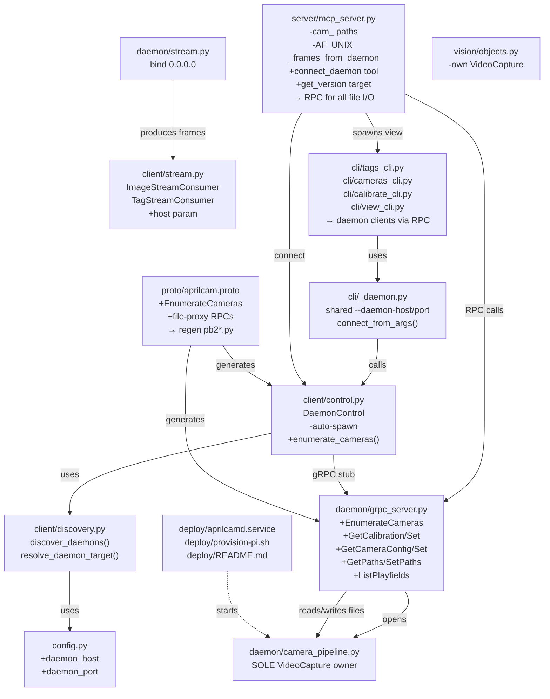
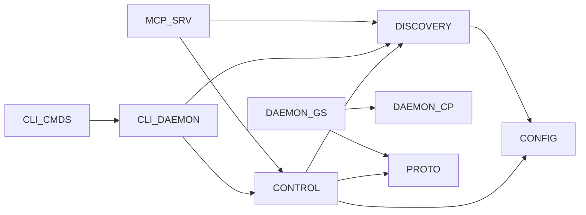

<!-- CLASI: Before changing code or making plans, review the SE process in CLAUDE.md -->

# Architecture Update -- Sprint 014: Remote Daemon over TCP with Discovery and Single Camera Owner

## What Changed

This sprint makes five structural changes. They compose into one invariant:
**the daemon owns the camera; every client discovers it and talks gRPC**.

---

### 1. New `EnumerateCameras` RPC — daemon probes hardware, clients never do

**New proto message and RPC** (in `proto/aprilcam.proto`):
```
message CameraDevice { int32 index = 1; string name = 2; string slug = 3; }
message EnumerateCamerasResponse { repeated CameraDevice cameras = 1; }
rpc EnumerateCameras(Empty) returns (EnumerateCamerasResponse);
```
The existing `ListCameras` RPC keeps its meaning ("currently-open cameras").
`EnumerateCameras` is new: the daemon runs `camutil.list_cameras()` and
returns available (not necessarily open) devices.

**Handler** in `daemon/grpc_server.py`: calls `camutil.list_cameras()` under
a lock; returns the result as repeated `CameraDevice` messages.

**Client stub** in `client/control.py`: new `enumerate_cameras()` method
returns `list[CameraDevice]`.

Regenerate `src/aprilcam/proto/aprilcam_pb2*.py` with `grpcio-tools`.

---

### 2. Camera-owner invariant enforcement — remove all non-daemon `VideoCapture`

**MCP server (`server/mcp_server.py`):**
- Delete the `cam_<index>` exclusive-capture branches in `start_detection`
  (~1104) and `stream_tags` (~2769) that call `cv2.VideoCapture(camera_index)`.
- Delete the matching re-open teardown in `stop_detection`/`stop_stream`
  (~1192/~2876).
- All detection and stream-tag paths become `DaemonCapture`-only (RPC).
- `_handle_list_cameras` calls `client.enumerate_cameras()` RPC instead of
  `camutil.list_cameras()`.
- `_frames_from_daemon` (AF_UNIX path) is replaced by `client.capture_frame()`
  gRPC call in `resolve_source()` / `_read_one_frame()`.

**CLI commands:**
- `cli/tags_cli.py`: replace `cv.VideoCapture(cam_index)` + local
  `detect_all_tags` with `OpenCamera` + `GetTags` RPC via `DaemonControl`.
- `cli/cameras_cli.py`: replace local `camutil.list_cameras()` probe with
  `EnumerateCameras` RPC.
- `cli/calibrate_cli.py:159`: replace local `list_cameras` selection with
  `EnumerateCameras` RPC. Camera capture already routes through `_DaemonCapture`.

**`vision/objects.py`:** The `ObjectTracker` class opens `cv.VideoCapture`
at `__init__.start()` (~281). This class is used from the `get_objects` MCP
path, which should read from the detection ring buffer instead. Audit:
either remove `ObjectTracker`'s own capture and feed it from the daemon
pipeline, or gate the class so it is only reachable from daemon-internal
code. The `get_objects` MCP handler must not instantiate `ObjectTracker`
with a device index.

**Audit and confine legacy openers:** `core/aprilcam.py`, `calibration/calibration.py`,
`camera/camera.py`, `camera/video_camera.py` contain `VideoCapture` references
that are daemon-internal or dead code paths. None must be reachable from any
client entry point (CLI command, MCP tool handler). Add a `# DAEMON-ONLY`
comment at each remaining `VideoCapture` site.

---

### 3. New `client/discovery.py` — mDNS browser + shared resolver

**New module `src/aprilcam/client/discovery.py`:**

```
DaemonInfo: dataclass { name: str, host: str, port: int, addresses: list[str] }

discover_daemons(timeout: float = 1.0) -> list[DaemonInfo]
    Browse _aprilcam._tcp.local. using zeroconf ServiceBrowser.
    Returns discovered services. Gracefully returns [] if zeroconf unavailable.

resolve_daemon_target(config: Config, cli_args=None) -> tuple[str, int, str|None]
    Returns (host, port, unix_path|None).
    Precedence (highest wins):
      1. cli_args.daemon_host / cli_args.daemon_port
      2. APRILCAM_DAEMON_HOST / APRILCAM_DAEMON_PORT env / config fields
      3. Running local Unix socket (probe only, never spawn)
      4. mDNS: 1 found → auto-select, >1 → error, 0 → hard error
```

**`DaemonControl.connect_default` refactored:**
- Remove the auto-spawn path entirely (the `subprocess.Popen` block).
- Call `resolve_daemon_target(config, cli_args)` to get `(host, port, unix_path)`.
- Attempt `connect()` and a probe `ListCameras` call.
- If unreachable, raise a `DaemonNotFoundError` with the resolution attempt
  logged, never spawn.

**`cli/_daemon.py` (new):** shared argparse group `--daemon-host/--daemon-port`
and a `connect_from_args(config, args) -> DaemonControl` helper. All client
commands (`tags`, `cameras`, `calibrate`, `view`, `web`) import and use this
helper. Eliminates per-command connection logic.

**`config.py` additions:** `daemon_host: str | None = None` and
`daemon_port: int = 5280` fields, read from `APRILCAM_DAEMON_HOST` and
`APRILCAM_DAEMON_PORT`. Sprint 013 may have added stubs; if so, activate them.

**`aprilcam mcp` argv parsing:** `mcp_server.py:main()` parses
`--daemon-host`/`--daemon-port` from `sys.argv` before starting the server.
These override the config fields for the session.

**`zeroconf` promoted to base deps** in `pyproject.toml`. Removed from the
`daemon` extra. Client code that imports `discover_daemons` degrades
gracefully (`try: import zeroconf; except ImportError: return []`).

---

### 4. File-proxy RPCs — daemon owns its files, MCP uses gRPC blobs

**Additional proto messages and RPCs** (add to `proto/aprilcam.proto`):

| RPC | Request | Reply | Replaces |
|-----|---------|-------|----------|
| `GetCameraConfig` | `CameraRequest {cam_name}` | `{json_blob}` | local `load_camera_config()` |
| `SetCameraConfig` | `{cam_name, json_blob}` | `StatusReply` | local `save_camera_config()` |
| `GetCalibration` | `CameraRequest` | `{json_blob, present: bool}` | local `load_calibration_from_camera_dir()` |
| `SetCalibration` | `{cam_name, json_blob}` | `StatusReply` | local save + `ReloadCalibration` |
| `GetPaths` | `CameraRequest` | `{json_blob}` | local `paths.json` read |
| `SetPaths` | `{cam_name, json_blob}` | `StatusReply` | local `_write_paths_json` |
| `ListPlayfields` | `Empty` | `repeated {name, json_blob}` | local `playfield_def_registry.load_all()` |

All RPCs are unary (no streaming). JSON blobs are UTF-8 strings in the proto.

**Daemon handlers** (`daemon/grpc_server.py`): each handler reads or writes
the per-camera file atomically (`tmp` + `os.replace`) using the existing
`save_*`/`load_*` helpers from `calibration/calibration.py` and
`camera/camera_config.py`. `SetCalibration` writes then triggers a pipeline
reload. `ListPlayfields` scans `config.playfields_dir / "*.json"`.

**Refactor parse-from-dict:** `load_calibration_from_camera_dir` and
`load_camera_config` gain companion pure-parse helpers that accept a `dict`
rather than a `Path`. These are used by the MCP side when it receives a JSON
blob from an RPC. No duplication of parsing logic.

**MCP server changes:**
- `_handle_open_camera`: call `GetCalibration` and `GetCameraConfig` RPCs
  instead of reading local paths; use parse-from-dict helpers.
- `calibrate_playfield`: call `SetCalibration` RPC to persist the result.
- `set_camera_playfield`: call `SetCameraConfig` RPC.
- Path tools: call `GetPaths`/`SetPaths` RPCs.
- Startup: call `ListPlayfields` on connect to load playfield defs.
- Audit and remove all `_cam_info["camera_dir"]` and `paths_file` uses that
  assume daemon files are local.

---

### 5. TCP streaming and `connect_daemon` MCP tool

**Daemon stream binding (`daemon/stream.py`):**
- `_bind_tcp_socket()` changes `sock.bind(("127.0.0.1", 0))` to
  `sock.bind(("0.0.0.0", 0))`. Stream sockets are now reachable from the LAN.

**Stream consumers (`client/stream.py`):**
- `ImageStreamConsumer` and `TagStreamConsumer` accept an optional `host`
  parameter (default `"localhost"`). When the `DaemonControl` is TCP-connected,
  callers pass `dc.host`; when Unix-connected, callers pass `"localhost"`.
- The `_connect_tcp()` method uses the provided host.

**`start_live_view` in MCP server:**
- Passes `--daemon-host <host>` and `--daemon-port <port>` to the
  `aprilcam view` subprocess when connected via TCP.

**`aprilcam view` CLI (`cli/view_cli.py`):**
- Reads `--daemon-host`/`--daemon-port` from shared `cli/_daemon.py` group.
- Uses host-aware `ImageStreamConsumer`.

**MCP tool `connect_daemon(host=None, port=5280, local=False)`:**
- `host=None`: re-runs `resolve_daemon_target(config)` (mDNS).
- `local=True`: force Unix socket regardless of host.
- On switch: stop all detection loops; stop live views; call
  `registry.close_all()`; clear `_cam_info`, frame/composite/path/playfield
  registries; close old gRPC channel.
- Connect + probe new target; call `ListPlayfields` and populate the playfield
  def registry.
- Return: `{target: "<host>:<port>", cameras: [...]}`

**`get_version` tool:** include `active_daemon_host` and `active_daemon_port`
in the response.

---

### 6. Pi deployment assets (new files)

**`deploy/aprilcamd.service`** (extends Sprint 013's scaffolded unit):
```ini
[Unit]
Description=AprilCam daemon
After=network-online.target avahi-daemon.service
Wants=network-online.target

[Service]
Type=simple
User=eric
SupplementaryGroups=video
RuntimeDirectory=aprilcam
StateDirectory=aprilcam
LogsDirectory=aprilcam
ConfigurationDirectory=aprilcam
Environment=APRILCAM_DATA_DIR=/home/eric/aprilcam-data
Environment=APRILCAM_SOCKET_DIR=/run/aprilcam
Environment=APRILCAM_LOG_LEVEL=INFO
ExecStart=/home/eric/.local/share/pipx/venvs/aprilcam/bin/python \
    -m aprilcam.daemon --tcp --tcp-port 5280 --unix
Restart=on-failure
RestartSec=5

[Install]
WantedBy=multi-user.target
```

**`deploy/provision-pi.sh`**: script that:
- `apt install python3-venv python3-pip pipx v4l-utils libgl1 libglib2.0-0 avahi-daemon`
- `sudo usermod -aG video eric`
- `pipx ensurepath`
- Creates `~/aprilcam-data/{cameras,playfields}`

**`deploy/README.md`**: runbook documenting wheel build, scp, pipx install,
systemd enable, seed calibration (rsync or remote calibrate), firewall note,
`mss` headless check.

---

## Why

| Change | Use Cases Addressed |
|--------|---------------------|
| `EnumerateCameras` RPC | SUC-001, SUC-002 |
| Remove direct `VideoCapture` in MCP and CLI | SUC-002 |
| `vision/objects.py` capture removal | SUC-002 |
| `client/discovery.py` + resolver | SUC-001, SUC-003 |
| Remove `DaemonControl` auto-spawn | SUC-001 |
| Shared `cli/_daemon.py` | SUC-001, SUC-006 |
| `Config` daemon_host/daemon_port | SUC-001, SUC-003 |
| `zeroconf` to base deps | SUC-001 |
| File-proxy RPCs (GetCalibration, SetCalibration, etc.) | SUC-005 |
| Parse-from-dict refactor | SUC-005 |
| `daemon/stream.py` bind `0.0.0.0` | SUC-004 |
| Host-aware stream consumers | SUC-004 |
| `connect_daemon` MCP tool | SUC-003 |
| `get_version` active target | SUC-003 |
| `start_live_view` passes daemon host | SUC-004 |
| Pi deployment assets | SUC-006 |

---

## Impact on Existing Components

| Component | Change | Backward-Compatible? |
|-----------|--------|----------------------|
| `proto/aprilcam.proto` | New messages and RPCs; no existing messages changed | Yes — additive |
| `src/aprilcam/proto/aprilcam_pb2*.py` | Regenerated from proto | Yes |
| `daemon/grpc_server.py` | New RPC handlers; existing handlers unchanged | Yes |
| `daemon/stream.py` | `_bind_tcp_socket` changes bind address to `0.0.0.0` | Breaking for external tooling that relied on localhost-only streams |
| `client/control.py` | `connect_default` removes auto-spawn; new `enumerate_cameras()` method | Breaking: callers that relied on auto-spawn must pre-start daemon |
| `client/stream.py` | `host` param added with default `"localhost"` | Yes (default preserves existing behavior) |
| `client/discovery.py` | New module | N/A |
| `cli/_daemon.py` | New module | N/A |
| `server/mcp_server.py` | `cam_<index>` paths removed; list_cameras → RPC; file I/O → RPC; new `connect_daemon` tool; `get_version` extended | Breaking: `cam_<index>` handle type is removed |
| `cli/tags_cli.py` | RPC path replaces local capture | Breaking: requires daemon running |
| `cli/cameras_cli.py` | RPC call replaces local probe | Breaking: requires daemon running |
| `cli/calibrate_cli.py` | Camera selection → RPC | Breaking: requires daemon running |
| `cli/view_cli.py` | Reads daemon host from shared helper | Breaking: view now requires daemon |
| `vision/objects.py` | `ObjectTracker.start()` stops opening its own VideoCapture | Breaking: callers that pass a raw device index must update |
| `config.py` | Two new fields; no existing fields removed | Yes |
| `pyproject.toml` | `zeroconf` moved from `daemon` to base | Yes |
| `calibration/calibration.py` | New parse-from-dict companion functions | Yes (additive) |
| `camera/camera_config.py` | New parse-from-dict companion function | Yes (additive) |

---

## Migration Concerns

### `DaemonControl` auto-spawn removal

Existing workflows that call `DaemonControl.connect_default()` expecting the
daemon to launch automatically will now receive `DaemonNotFoundError` if the
daemon is not running. Mitigation: document in runbook that `aprilcam daemon
start` or `systemctl start aprilcamd` must precede any client invocation.
The MCP server startup sequence is updated accordingly.

### `cam_<index>` handle type removal

The MCP server no longer accepts `cam_0`, `cam_1`, etc. as source IDs.
All source IDs must go through `open_camera` (which opens via daemon). Any
agent workflow that caches `cam_<N>` handles from a previous session must
call `open_camera` again.

### Stream socket network exposure

`daemon/stream.py` now binds `0.0.0.0`. On LANs without a firewall, the
stream sockets (which use ephemeral ports) are reachable from any host.
This is acceptable on a trusted lab LAN. Document in `deploy/README.md`.
No TLS in this sprint.

### MCP file I/O → gRPC proxy

MCP tools that previously read/wrote calibration, config, and paths files
locally now call RPCs. If the daemon is not running, these operations fail
with a gRPC error instead of a local filesystem error. Error messages must
be updated to say "daemon unreachable" rather than "file not found".

### Sprint 013 dependency

Sprint 013 must merge before Sprint 014 executes. Sprint 014 adopts the
`Config` fields (`daemon_host`, `daemon_port`, `log_dir`), the FHS/XDG
directories, and the `deploy/aprilcamd.service` scaffold from Sprint 013.
If Sprint 013 adds stub `CONFIG_VARS` entries for `APRILCAM_DAEMON_HOST`/
`APRILCAM_DAEMON_PORT`, Sprint 014 activates them (adds logic); otherwise
Sprint 014 adds both the fields and the `CONFIG_VARS` entries.

---

## Component Diagram



## Dependency Graph



No cycles. Dependency direction: CLI/MCP → client → discovery → config;
daemon is a leaf (no imports from client or server packages).

---

## Design Rationale

### Decision: `DaemonControl.connect_default` removes auto-spawn entirely

**Context:** Auto-spawn hides the fact that the daemon is not running. In a
remote Pi scenario, spawning a local process is wrong: the cameras are on the Pi.

**Alternatives considered:**
1. Auto-spawn local daemon, fall back to mDNS for remote (ambiguous behavior).
2. Remove auto-spawn entirely; require daemon to be pre-started (chosen).

**Why option 2:** A clear "daemon not found" error is always better than
silently spawning the wrong process. The only daemon starters are
`aprilcam daemon start` and `systemctl start aprilcamd` — both explicit and
intentional. This matches the remote Pi use case.

**Consequences:** Any runbook or documentation that says "just call any tool
and the daemon will start" must be updated.

---

### Decision: `resolve_daemon_target` precedence — env/explicit before mDNS

**Context:** On multi-daemon LANs, mDNS returns ambiguous results. The
resolver must provide a deterministic path.

**Alternatives considered:**
1. Always browse mDNS; require `APRILCAM_DAEMON_HOST` only for ambiguity.
2. Explicit > local unix > mDNS (chosen).

**Why option 2:** The most explicit signal (env var or CLI flag) wins without
any network round-trip. Local unix socket probe is cheap and handles on-box
CLI (the Pi's own CLI talking to the Pi's daemon). mDNS browse is a last
resort. This precedence is predictable and debuggable.

**Consequences:** When `APRILCAM_DAEMON_HOST` is set, mDNS is never
consulted, even on a single-daemon LAN. This is the right trade-off for
scripts and CI.

---

### Decision: JSON blobs in file-proxy RPCs, not structured protobuf fields

**Context:** Calibration, config, and paths files have varying schemas that
already have Python serialization helpers (`to_dict`/`from_dict`). Two options
for the gRPC representation: (a) model each field in protobuf, or (b) carry
the JSON as an opaque string.

**Why JSON blobs:** The existing parse-from-dict helpers already exist; adding
protobuf field mirroring would duplicate them. JSON blobs are forward-compatible
when fields are added to the data model. The performance cost is negligible
(these are infrequent, non-hot-path calls). Consistency with how the MCP tool
already serializes these dicts (JSON in MCP responses) makes the code easier
to follow.

**Consequences:** Daemon handlers must serialize; clients must deserialize.
No schema enforcement at the gRPC boundary — schema errors surface as parse
exceptions on the client side.

---

### Decision: `zeroconf` promoted to base deps

**Context:** Currently in the `daemon` extra. CLI clients need to browse; they
do not need to serve.

**Why base:** Any CLI install (`pipx install aprilcam`) will need discovery.
The `zeroconf` package is small and pure-Python. Keeping it daemon-only means
users of `aprilcam cameras` would need `aprilcam[daemon]` just for discovery,
which is wrong.

**Consequences:** All installs get `zeroconf`. Degrade gracefully on import
failure so the package still works in locked environments that exclude it.

---

### Decision: No TLS in this sprint

**Context:** gRPC over TCP between Mac and Pi uses insecure transport.

**Why:** Trusted lab LAN. TLS adds certificate management complexity with no
benefit in the current deployment context. Documented as a known limitation in
`deploy/README.md`.

**Consequences:** Anyone who runs this on an untrusted network must add a VPN
or accept the risk. Sprint note: TLS deferred to a future sprint.

---

## Open Questions

1. **`vision/objects.py` `ObjectTracker`:** Is `ObjectTracker` currently
   reachable from any MCP tool path? If `get_objects` does not instantiate
   `ObjectTracker`, the change scope is limited to documentation and a comment.
   The implementer must audit `get_objects` to confirm.

2. **`mss` headless import on Pi:** The issue flags this as a pre-block. The
   ticket for Pi deployment must verify `import mss` does not execute at
   module import time when `mss` is an optional dep. If it does, the fix is
   a lazy import or a `pi`/`daemon-headless` extra.

3. **`vidar.local` SSH access:** Key not yet in place. The live bring-up ticket
   for `vidar` is gated on this. If it is not resolved by the time the code
   tickets are done, the `vidar` ticket is deferred.

4. **opencv-contrib aarch64/cp312 wheel availability:** The provision script
   should attempt pip install and fall back to `apt python3-opencv` +
   `--extra-index-url https://www.piwheels.org/simple` if the wheel is not
   found. Confirm before the deploy ticket executes.
