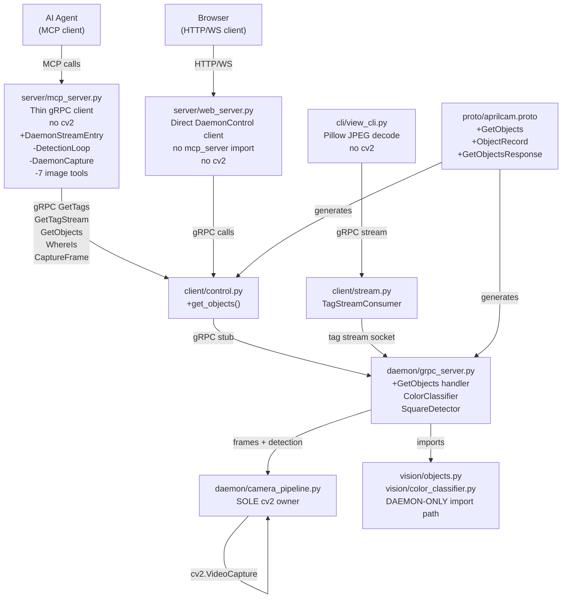
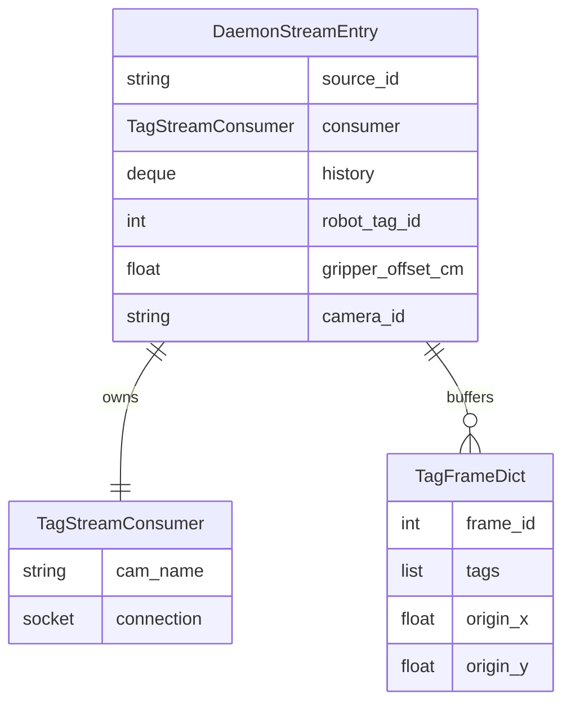
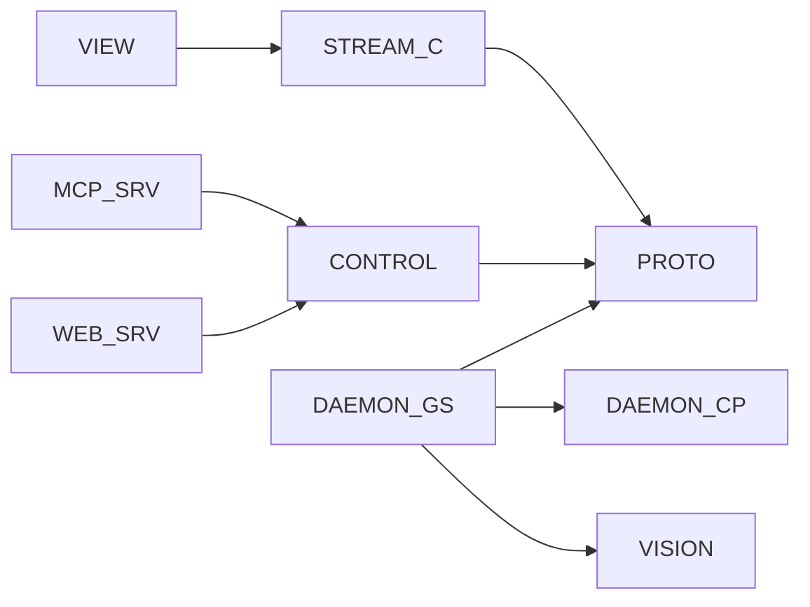

<!-- CLASI: Before changing code or making plans, review the SE process in CLAUDE.md -->

# Architecture Update -- Sprint 015: Thin MCP/web/view Clients — Daemon Is the Sole Vision Authority

## What Changed

This sprint makes four structural changes that together enforce one invariant:
**the daemon is the sole component that does any computer vision**. Clients
consume perception results and raw JPEG frames only.

---

### 1. MCP server: in-process detection machinery removed; tag tools rewired to daemon

**Deleted from `server/mcp_server.py`**:
- `DaemonCapture` class (~lines 209–237) — the cv2.VideoCapture-compatible wrapper
  around a gRPC `CaptureFrame` call. Was used to feed `DetectionLoop`.
- `DetectionLoop` + `AprilCam` instantiation in `_handle_start_detection` and
  `stream_tags` (~lines 1034–1200, ~2780–2910).
- `resolve_source()` (~line 429) — the function that returned a numpy frame by
  calling `DaemonCapture.read()`.
- `_resolve_source_playfield()` — only used by the in-process detection path.
- `RingBuffer` import from `aprilcam.core.detection` (no longer needed by MCP).
- `DetectionEntry` dataclass fields that held numpy-bearing objects (`loop`,
  `aprilcam`, `ring_buffer`).

**Rewired in `server/mcp_server.py`**:

| Old (in-process) | New (daemon RPC) |
|------------------|-----------------|
| `stream_tags` starts `DetectionLoop` thread | `stream_tags` calls `GetTagStream` RPC; subscribes to tag stream socket; buffers `TagFrame` dicts in a lightweight `deque` |
| `start_detection` same as above | same as `stream_tags` |
| `stop_stream`/`stop_detection` stops `DetectionLoop` | closes `TagStreamConsumer` |
| `get_tags` reads from `RingBuffer` (numpy) | reads latest `TagFrame` dict from the deque |
| `get_tag_history` returns N `RingBuffer` entries | returns N `TagFrame` dicts from deque |
| `_handle_get_objects` runs `ColorClassifier` + `cv2.pointPolygonTest` | calls `GetObjects` RPC; returns structured result |
| `where` calls local `_handle_where` with local playfield registry | unchanged (already pure-data; no pixels) |

**Preserved in `server/mcp_server.py`** (pure-data, no cv2):
- Gripper world-xy computation: `_compute_gripper_world_xy()` — operates on tag
  dict fields and homography matrix (numpy is fine here; no frames).
- A1 coord transform: `_a1_coord_transform()` — pure math on scalars.
- `_get_playfield_origin()` — reads from playfield registry (no pixels).
- All playfield registry management, calibration, file-proxy RPCs — unchanged.

**Detection state model** replaces `DetectionEntry`:

```
DaemonStreamEntry:
    source_id: str
    consumer: TagStreamConsumer     # gRPC tag stream subscription
    history: deque[dict]            # ring of TagFrame dicts (maxlen=300)
    robot_tag_id: int | None
    gripper_offset_cm: float
    _camera_id: str | None          # for playfield lookup
```

No numpy arrays or cv2 objects in this struct.

---

### 2. Image-processing MCP tools: deleted

**Deleted from `server/mcp_server.py`** (tool defs + handlers + helpers):
- `detect_lines` / `process_detect_lines` import
- `detect_circles` / `process_detect_circles` import
- `detect_contours` / `process_detect_contours` import
- `detect_motion` / `process_detect_motion` (inline import)
- `detect_qr_codes` / `process_detect_qr_codes` import
- `crop_region`
- `apply_transform` / `process_apply_transform` (inline import)
- `_FrameEntry` / frame-processing machinery that served only these tools

**Deleted from `vision/image_processing.py`**: not deleted as a file (may be used
by daemon internals), but no longer imported from `mcp_server.py`.

**Deleted tests**: any test file under `tests/` that exercises the above seven tools.

**No replacement**: consumers that need pixel processing call `get_frame` /
`capture_frame` (pass-through JPEG from daemon) and run their own CV outside MCP.

---

### 3. Daemon: new `GetObjects` RPC

**`proto/aprilcam.proto`** additions:

```proto
// GetObjects — one-shot object detection on a live camera frame.
message ObjectRecord {
  float cx_px       = 1;
  float cy_px       = 2;
  float wx          = 3;   // world X cm (A1-centred); 0 = uncalibrated
  float wy          = 4;   // world Y cm (A1-centred); 0 = uncalibrated
  string color      = 5;
  int32  x_bbox     = 6;
  int32  y_bbox     = 7;
  int32  w_bbox     = 8;
  int32  h_bbox     = 9;
  float area_px     = 10;
  string object_type = 11;
  float confidence   = 12;
}

message GetObjectsResponse {
  string cam_name            = 1;
  repeated ObjectRecord objects = 2;
}

// (added to service AprilCam)
rpc GetObjects (CameraRequest) returns (GetObjectsResponse);
```

Stubs regenerated via `scripts/compile_proto.py` (runs `grpcio-tools`).

**`daemon/grpc_server.py`** new handler `GetObjects`:
- Fetches the latest frame from `camera_pipeline` for the requested camera.
- Instantiates `ColorClassifier` + applies polygon filter (port of current
  `_handle_get_objects` logic, minus numpy-from-cv2 path).
- Returns `GetObjectsResponse` with `ObjectRecord` repeated.

**`client/control.py`** new method `get_objects(cam_name: str) -> GetObjectsResponse`.

---

### 4. web "hub" rewritten as direct daemon client

**`server/web_server.py`** rewritten:
- Imports: `DaemonControl` + `DaemonStreamEntry`-equivalent consumer; **no**
  `from aprilcam.server.mcp_server import ...`.
- Endpoint surface (1:1 mapping to daemon RPCs):

| HTTP endpoint | Daemon RPC |
|---------------|-----------|
| `POST /api/list_cameras` | `EnumerateCameras` |
| `POST /api/tags` | `GetTags` |
| `POST /api/objects` | `GetObjects` |
| `POST /api/where` | `WhereIs` |
| `GET /api/frame` | `CaptureFrame` (JPEG passthrough) |
| `WS /ws/tags` | `GetTagStream` socket → forward `TagFrame` JSON |
| `POST /api/overlay` | `PublishOverlay` |

- No pixel work in `web_server.py`. JPEG from `CaptureFrame` is forwarded as-is.
- The existing `_TOOL_SPECS` discovery endpoint is updated to reflect only the
  endpoints listed above.

---

### 5. view_cli.py: Pillow replaces cv2 for JPEG decode

**`cli/view_cli.py`**:
- `cv2.imdecode(buf, cv2.IMREAD_COLOR)` → `Image.open(BytesIO(jpeg_bytes))`.
- `_draw_object_boxes()` (~line 119) used `cv2.rectangle` / `cv2.putText` on
  a numpy array. Since objects now arrive as structured dicts from `GetObjects`
  (no numpy frame in `view_cli`), annotation switches to `ImageDraw.rectangle()` /
  `ImageDraw.text()` on a Pillow `Image`, or is removed if unneeded.
- Residual `import cv2 as _cv` at line 120 and `import cv2 as cv` at line 374
  are removed.
- `import numpy as np` removed if no longer needed (check: `_tag_dict_to_aprilcam`
  uses `np.array` for corners → keep np if still needed; otherwise remove).

---

### 6. Packaging boundary enforced

**`pyproject.toml`**:
- `opencv-contrib-python` moves from base `[project.dependencies]` (or from the
  `imaging` extra) to `[project.optional-dependencies.daemon]`.
- `pillow>=10.0` added to `[project.dependencies]` (already in `imaging` extra;
  promote to base).
- `[project.optional-dependencies.imaging]` extra removed or reduced to nothing
  (no longer needed once opencv is daemon-only).

**`cli/__init__.py`**:
- `DAEMON_COMMANDS` frozenset currently contains `{"daemon", "mcp", "web",
  "taggen", "calibrate", "cameras", "tags", "view"}`.
- After this sprint, `mcp`, `web`, `view`, `cameras`, `tags` are opencv-free
  and no longer need the "install aprilcam[daemon]" hint.
- New `DAEMON_COMMANDS = frozenset({"daemon", "taggen", "calibrate"})`.

---

## Why

| Change | Use Cases Addressed |
|--------|---------------------|
| Delete image-processing tools | SUC-001, SUC-006 |
| Remove in-process DetectionLoop / AprilCam / DaemonCapture | SUC-001, SUC-002, SUC-006 |
| Rewire stream_tags / get_tags / get_tag_history → daemon stream | SUC-002 |
| Add daemon GetObjects RPC | SUC-003 |
| Rewrite web_server → direct DaemonControl client | SUC-004 |
| Slim view_cli → Pillow JPEG decode | SUC-005 |
| Move opencv to daemon extra; Pillow to base | SUC-006 |
| Docs / DAEMON_COMMANDS cleanup | SUC-006, SUC-007 |

---

## Impact on Existing Components

| Component | Change | Backward-Compatible? |
|-----------|--------|----------------------|
| `server/mcp_server.py` | Remove detection machinery; delete 7 tools; rewire tag tools; `get_objects` → RPC | Breaking: 7 tools gone from MCP surface |
| `server/web_server.py` | Full rewrite; no mcp_server import | Breaking: internal structure; API surface preserved where possible |
| `cli/view_cli.py` | cv2 → Pillow for JPEG decode; `_draw_object_boxes` → ImageDraw | Yes (same display, no behavior change) |
| `proto/aprilcam.proto` | +`GetObjects` RPC, +`ObjectRecord`, +`GetObjectsResponse` | Yes — additive |
| `src/aprilcam/proto/aprilcam_pb2*.py` | Regenerated | Yes |
| `daemon/grpc_server.py` | +`GetObjects` handler | Yes — additive |
| `client/control.py` | +`get_objects()` method | Yes — additive |
| `vision/objects.py` | No change to file; import path is now daemon-only | Yes |
| `vision/color_classifier.py` | No change to file; import path is now daemon-only | Yes |
| `vision/image_processing.py` | No change to file; no longer imported from mcp_server | Yes |
| `cli/__init__.py` | `DAEMON_COMMANDS` reduced | Breaking: commands removed from hint set |
| `pyproject.toml` | `opencv-contrib` → daemon extra; Pillow → base | Breaking: base install no longer pulls opencv |

---

## Migration Concerns

### MCP tool surface reduction

Seven MCP tools are deleted. Any agent workflow that calls `detect_lines`,
`detect_circles`, `detect_contours`, `detect_motion`, `detect_qr_codes`,
`crop_region`, or `apply_transform` must be updated to call `get_frame` /
`capture_frame` and run its own CV. This is a stakeholder-approved breaking change.

### stream_tags / start_detection behavior change

Previously, `stream_tags` started a local `DetectionLoop` that polled the daemon
for frames via gRPC `CaptureFrame` and ran AprilTag detection in-process. After
this sprint, `stream_tags` subscribes to the daemon's `GetTagStream` socket. The
observable behavior to the agent is identical (call `get_tags` to read results),
but the implementation path is completely different. Latency characteristics may
change slightly (stream push vs. in-process detection loop).

### web_server internal structure

`web_server.py` is a full rewrite. Any code that imports from `web_server.py`
directly (unusual but possible in tests) may break. Tests that mock `mcp_server`
handlers are no longer applicable to the web layer.

### Packaging install split

Existing machines with `pipx install aprilcam` will need `pipx install
aprilcam[daemon]` to run the daemon after this sprint. Machines that only run
client commands (`mcp`, `web`, `view`) will no longer install opencv on upgrade.

---

## Component Diagram



## Entity Relationship — DaemonStreamEntry (replaces DetectionEntry)



## Dependency Graph



No cycles. Dependency direction: clients (MCP, web, view) → client library
(control, stream) → proto; daemon is a leaf (no imports from client or server).
`vision/` is imported only by `daemon/grpc_server.py`.

---

## Design Rationale

### Decision: Tag history buffered as plain dicts client-side (not a new daemon RPC)

**Context**: `get_tag_history` needs the last N tag frames. Two options: (a) add a
`GetTagHistory` RPC to the daemon that returns N buffered frames, or (b) the MCP
client subscribes to `GetTagStream` and accumulates a `deque` of `TagFrame` dicts.

**Alternatives considered**:
1. `GetTagHistory` RPC on the daemon — daemon must buffer frames server-side,
   adds state to the daemon, adds a proto message.
2. Client-side `deque` of tag-record dicts from `GetTagStream` (chosen).

**Why option 2**: The daemon already publishes `TagFrame` on its stream socket.
The MCP server already subscribes for `stream_tags`. Accumulating a `deque`
(maxlen=300) of the incoming dicts is zero added daemon complexity. The history
query is then a slice of the `deque` — pure Python, no gRPC round-trip. The
`deque` holds plain dicts (not numpy arrays), so there is no cv2 dependency.

**Consequences**: `get_tag_history` requires `stream_tags` to be active (no change
from current behavior). History is client-local; it is lost if the MCP server
restarts.

---

### Decision: `GetObjects` is a one-shot RPC, not a stream

**Context**: `get_objects` is called by the agent on demand (not in a tight loop).
Object detection involves HSV thresholding on a single frame. Two options:
(a) streaming `GetObjectStream`, (b) one-shot `GetObjects` that grabs a frame and
runs detection synchronously.

**Why one-shot**: Agents poll `get_objects` at human-loop rates. A streaming RPC
would require the daemon to run object detection continuously, increasing load for
a feature used sparingly. The one-shot pattern matches the current agent usage
pattern and keeps the daemon pipeline simpler.

**Consequences**: Each `get_objects` call incurs one frame capture + classification.
Acceptable at human-interaction rates.

---

### Decision: web_server full rewrite vs. thin wrapper

**Context**: `web_server.py` currently imports 15+ symbols from `mcp_server.py`
and uses `_handle_*` functions. Two options: (a) keep the indirection layer but
ensure `mcp_server` itself is opencv-free, or (b) rewrite `web_server` to call
`DaemonControl` directly.

**Why full rewrite**: Option (a) still forces `web_server` to depend on the MCP
server's import tree (which is large). The web server is a thin HTTP/WS bridge —
it does not need the MCP tool registration machinery, the `TextContent` wrappers,
or the playfield state machine from `mcp_server`. Direct `DaemonControl` usage is
simpler, faster, and makes the dependency graph clean. The web process has no
dependency on `mcp` at all after this sprint.

**Consequences**: Any test that mocked `mcp_server` handlers for web-layer tests
must be rewritten against the `DaemonControl` stub. This is a small test surface.

---

## Open Questions

1. **`view_cli.py` numpy usage**: `_tag_dict_to_aprilcam()` and related display
   helpers may use `np.array` for corners. If numpy is still needed for display
   math, the `numpy` import stays (numpy ≠ cv2). The implementer must confirm
   which imports are actually cv2 vs. numpy.

2. **`vision/image_processing.py` fate**: The file is not deleted (may be used by
   daemon internals or `calibrate_cli`). The implementer must grep for all importers
   and confirm it is not imported from any client path after the ticket executes.
   If it is only used in daemon code, add a `# DAEMON-ONLY` comment.

3. **Web endpoint parity with current surface**: `web_server.py` currently exposes
   endpoints for tools that will be deleted (e.g., `detect_lines`). These endpoints
   disappear in the rewrite. Any downstream consumer of the web API must be updated.
   The implementer should confirm whether any test or documentation references these
   endpoints.

4. **`_FrameEntry` / `create_composite` / frame-processing registry**: `mcp_server.py`
   has a frame-processing registry (`_FrameEntry`, `_frame_registry`) used by the
   image-processing tools. Deleting those tools may leave this registry dead code.
   The implementer must check whether `create_composite` / `get_composite_frame`
   also uses it — if so, the registry stays; if not, it is deleted too.
